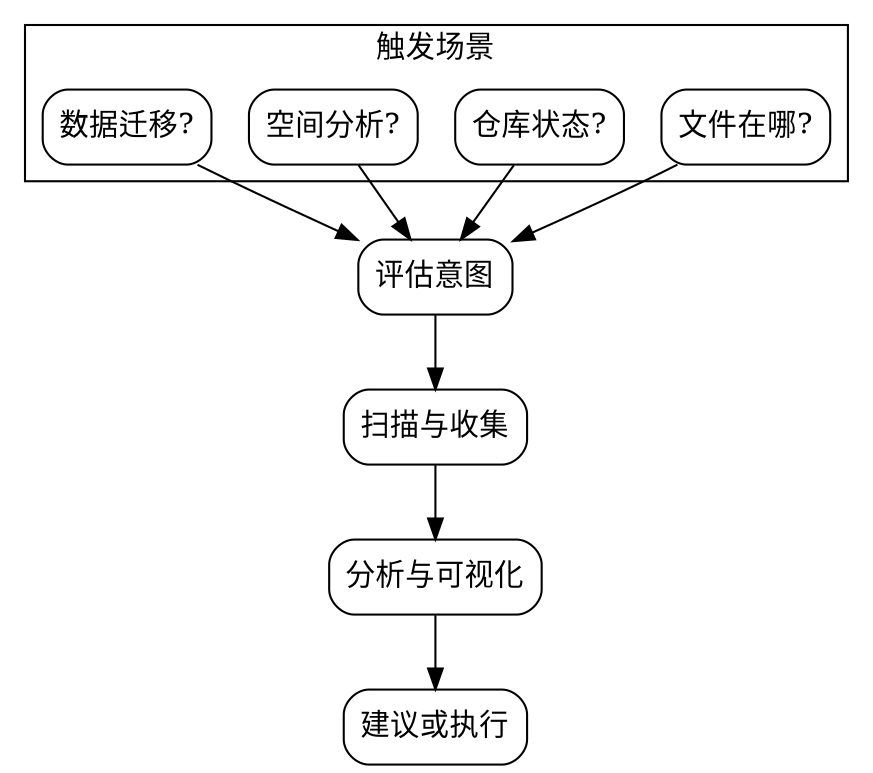

# 数据资产管理

## 概述

管理电脑数据资产的 skill，覆盖两个核心领域：
- **数据管理**：内容分类、空间分析、冗余识别、优化建议
- **代码仓管理**：状态检查、同步更新、无用仓库识别

## 何时使用

- 用户问"某个文件在哪"或"什么占了我的空间"
- 用户想了解代码仓库的整体状态
- 用户需要看数据类型分布和存储优化建议
- 用户要恢复出厂设置，需要数据迁移

## 工作流



根据用户意图选择工作模式：

| 用户意图 | 工作模式 | 产出 |
|----------|----------|------|
| 文件在哪 | 定位模式 | 文件路径 + 所属分类 |
| 仓库状态 | 检查模式 | 仓库健康度报告 |
| 空间/优化 | 分析模式 | 空间分布可视化 + 优化建议 |
| 数据迁移 | 迁移模式 | 完整迁移方案 |

---

## 模式一：定位模式

用户想知道什么文件在哪里。

**执行步骤：**
1. 确定搜索范围（文件名/类型/关键词）
2. 在常见位置搜索：home、Documents、Desktop、Downloads、云存储目录
3. 返回结果并标注文件分类（文档/代码/媒体/配置/缓存）

**输出格式：**
```
📄 文件名  →  完整路径  →  分类  →  大小
```

## 模式二：仓库状态检查

用户想了解代码仓库的整体状况。

**收集指标（每个仓库）：**

| 指标 | 作用 | 获取方式 |
|------|------|----------|
| 远程地址 | 判断是否可恢复 | `git remote get-url origin` |
| 分支 | 是否在非主分支 | `git rev-parse --abbrev-ref HEAD` |
| 提交数 | 投入深度 | `git rev-list --count HEAD` |
| 最后活跃 | 是否过期 | `git log -1 --format=%cd --date=short` |
| 语言组成 | 仓库类型 | 按扩展名统计文件数 |
| 脏状态 | 是否有未保存工作 | `git status --porcelain` |
| 未推送提交 | 数据丢失风险 | `git log @{upstream}..HEAD` |
| Stash | 隐藏的工作 | `git stash list` |
| 磁盘大小 | 空间成本 | `du -sk` |

**健康度判断：**

| 风险等级 | 条件 | 建议 |
|----------|------|------|
| 🔴 高风险 | 有未推送提交，或无远程有本地提交 | 立即推送或创建远程 |
| 🟡 需关注 | 有未提交改动、有 stash、超过2年未活跃 | 提醒用户处理 |
| 🟢 健康 | 干净且有远程，近期有活跃 | 无需操作 |

## 模式三：空间分析

用户想了解数据分布和优化空间。

**扫描范围与分类：**

| 分类 | 说明 | 典型位置 |
|------|------|----------|
| 代码仓库 | 所有 git 仓库 | workspace/repo 等 |
| SDK/工具链 | 编译器、运行时 | sdk/、.rustup/、.nvm/ 等 |
| 云存储 | 已同步的云端文件 | OneDrive、iCloud、Google Drive |
| 媒体文件 | 图片、视频、音乐 | Pictures、Movies、Music |
| 文档 | 个人文档 | Documents、Desktop |
| 缓存/临时 | 可安全清理 | Library/Caches、.tmp、build/ |
| 密钥/配置 | 不可丢失 | .ssh、.gnupg、.config |

**优化建议方向：**
- 大型第三方源码 → 是否需要本地保存？（通常可随时克隆）
- SDK/工具链 → 是否还在使用？（重装可重新下载）
- 构建产物 → `build/`、`target/`、`node_modules/` 可安全删除
- 缓存文件 → 浏览器缓存、包管理器缓存可清理
- 重复文件 → 大文件是否有多个副本

**展示方式：** 优先构建交互式 HTML 面板（单文件，无外部依赖），让用户直观看到分布和占比。空间不够大时用文本表格。

## 模式四：数据迁移

用户要恢复出厂设置或换电脑。

**四步流程：**


### 第一步：盘点
触发模式二（仓库状态检查）+ 模式三（空间分析），一次性输出完整资产清单。

### 第二步：分类
对每个资产标记：

| 分类 | 含义 | 迁移动作 |
|------|------|----------|
| 保留 | 有独立价值，继续使用 | 推送改动 → 重装后 clone |
| 整合 | 有价值但分散，需合并 | 推送后合并到目标仓库 |
| 废弃 | 无保留价值 | 跳过/删除 |

### 第三步：备份
按优先级执行：
1. 推送所有脏仓库的改动
2. 处理 stash（pop 提交或丢弃）
3. 为无远程的本地仓库创建远程并推送
4. 备份密钥（SSH/GPG）到安全位置
5. 导出 dotfiles 和包管理器列表
6. 确认云存储同步完成
7. 生成恢复脚本（remote URL 清单 + clone 命令）

### 第四步：清理
- 删除废弃资产
- 清理空目录

### 安全原则

- **删除前必须验证**：确认仓库远程可达或用户明确确认
- **删除顺序**：先删第三方（可重克隆），再删自己的（已有远程备份）
- **不留恢复手段不删除**：必须生成 remote URL 清单
- **未推送的不删除**：有未推送提交的仓库禁止标记为废弃

---

## 通用原则

**扫描效率**
- 一次扫描，结构化输出，避免多轮重复
- 排除无关目录：Library、.Trash、node_modules、build、target、.git 内部

**展示优先级**
- 能可视化就不列文字
- 能交互就不做静态报告
- HTML 面板必须单文件、零依赖、暗色主题

**安全兜底**
- 任何破坏性操作前确认
- 优先「移到废纸篓」而非 `rm -rf`
- 未推送 = 不可删除，无例外
