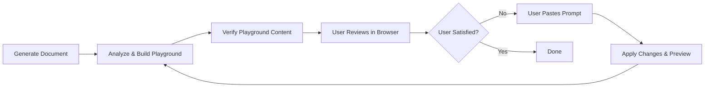

# Interactive Document Review

## Overview

Generate an interactive HTML playground for reviewing documents. The user reviews in a browser, approves/rejects AI suggestions, adds inline comments on any line, then pastes a generated prompt back for Claude to apply changes. Loop until confirmed.

## Workflow



## Key Principles

1. **User is in control**: The user decides when the review is complete, not the AI. Never assume "OK" — always wait for explicit confirmation.
2. **Preview before destructive changes**: For major structural changes (deleting sections, rewriting content), show a preview first.
3. **Verify playground content**: After building the HTML, confirm the document lines are correct before opening in browser.

## Step-by-step

### 1. Analyze and generate suggestions

Read the target document. Generate review suggestions as an array:

```javascript
const autoSuggestions = [
  {
    id: 'a1',
    lineRef: "Line 5-27",        // line range for display
    targetLineStart: 5,           // first line number (1-based)
    targetLineEnd: 27,             // last line number
    targetText: "short excerpt",  // first ~60 chars of target content
    suggestion: "what to improve and why",
    category: "clarity",          // clarity | completeness | consistency | correctness
    status: "pending",            // always "pending" initially
    userComment: "",              // always "" initially
    source: "auto"
  },
  // ... more suggestions
];
```

**Suggestion quality guidelines:**
- Reference specific line numbers, not vague sections
- Be actionable: state what's wrong AND what to do about it
- Focus on real issues, not cosmetic preferences
- Cross-check consistency between sections (e.g., if data-schema.md defines a field one way, data-persistence.md should match)
- 3-7 suggestions per round is the sweet spot. Fewer if the doc is short or clean.

### 2. Build the playground HTML

Build a single-file HTML playground. Read the full template from `references/playground-template.md` and fill in:

- `DOC_LINES` array: each element is one line of the document
- `autoSuggestions` array: from step 1
- `state.activeFilter` defaults to `"all"`
- `updatePrompt()` prefix: `Please update \`<filepath>\` with the following changes:`

Save to `<doc-dir>/<doc-name>-review.html` and open with `open`.

### 3. Verify playground content

**CRITICAL**: After writing the HTML file, always verify before opening in browser:

1. **DOC_LINES line count match**:
   ```bash
   # Count lines in source document
   wc -l <doc-path>
   # Count lines in DOC_LINES array (should be same)
   node -e "const fs=require('fs'); const h=fs.readFileSync('doc-review.html','utf8'); const m=h.match(/const DOC_LINES = \[([\s\S]*?)\];/); console.log(m[1].split(',\n').length)"
   ```

2. **DOC_LINES content match**: Check `DOC_LINES[0]` equals first line of document

3. **JavaScript syntax validation**:
   ```bash
   node -e "const fs=require('fs'); const h=fs.readFileSync('doc-review.html','utf8'); const m=h.match(/<script>([\s\S]*?)<\/script>/); try{new Function(m[1]);console.log('JS valid')}catch(e){console.error('JS error:',e.message)}"
   ```

4. **No unescaped template literals**: Verify no bare `${` appears outside of proper template contexts

If any check fails, rebuild the playground. Common failure causes:
- Chinese curly quotes (" ") in source file → escape as `"` in JS string
- Nested template literals like `` `${`${var}`}` `` → escape inner backticks as `\``

### 4. Wait for user feedback

The user reviews in the browser and either:
- Pastes the generated prompt back (has approved suggestions and/or user comments)
- Says "OK" / "确认" / "没问题" (document is finalized)

**IMPORTANT**: Do NOT interpret any response as final confirmation unless the user explicitly says so. If the user says things like "继续review" or "再看看", continue the review loop.

### 5. Preview before applying changes

For any "My Comments" or structural changes, BEFORE applying:
1. Read the proposed changes
2. If the changes are significant (deleting sections, rewriting substantial content), summarize what will change and ask: "我将应用以下修改，是否确认？"
3. Wait for explicit user confirmation before modifying the document

### 6. Apply changes

Parse the user's pasted prompt and apply each change to the document. Changes fall into three categories:

| Section in prompt | Action |
|-------------------|--------|
| Approved Improvements | Apply the suggestion |
| My Comments | Apply the user's comment as instruction |
| Rejected | Skip (listed for context only) |

### 7. Rebuild playground

After applying changes:
1. Re-read the updated document
2. Generate new suggestions (don't repeat already-addressed items)
3. Rebuild the playground HTML with updated `DOC_LINES` and new suggestions
4. Verify the new DOC_LINES matches the updated document
5. Open in browser

If no new suggestions are warranted, build the playground with an empty `autoSuggestions` array and a message: "No auto suggestions this round. Click any line to add your comment."

### 8. Explicit confirmation check

Ask: "还有其他需要修改的吗？确认完成后我会删除 review HTML 文件。"

Repeat steps 4-7 until user confirms completion.

## Prompt output format

The playground's prompt output groups feedback into sections. Only non-empty sections appear:

```
Please update `doc/xxx.md` with the following changes:

## Approved Improvements
- **Line 5** [clarity]: suggestion text
  User note: additional context from user

## My Comments
- **Line 12** (`excerpt`):
  user's inline comment text

## Additional Feedback
- **Line 8** [Rejected, completeness]: user's note on rejected item

## Rejected (for context)
- ~~Line 3: rejected suggestion~~
```

## Key features of the playground

- **Click any line** to add an inline comment (even lines without AI suggestions)
- **Hover** reveals a `+` button on uncommented lines
- **Ctrl+Enter** saves inline comments; **Esc** cancels
- **Filter tabs**: All / Pending / Approved / Rejected / My Comments
- **Auto-highlighting**: pending=amber, approved=green, rejected=red, user comment=blue
- **Click to navigate**: clicking a highlighted line scrolls to its suggestion card and vice versa
- **Live prompt**: updates instantly as the user approves/rejects/comments
- **Copy button**: one-click copy of the generated prompt

## When NOT to use this skill

- Simple typo fixes or one-line changes (just edit directly)
- Documents the user is still actively drafting (review comes after drafting)
- Non-text artifacts (images, binary files)

## Common Issues and Solutions

### "内容为空" / Playground shows wrong content
**Cause**: DOC_LINES in the HTML is stale (doesn't match current document state)
**Solution**: Always re-read the document from disk before rebuilding playground. Verify DOC_LINES matches document before opening in browser.

### Misunderstanding user feedback
**Cause**: User's feedback may not match what was actually generated
**Solution**: For structural changes, always preview and confirm before applying. When in doubt, ask for clarification.

### User says "ok" but wants to continue
**Cause**: "OK" can mean different things
**Solution**: Wait for explicit confirmation phrases like "确认", "没问题", "可以了" rather than interpreting "ok" as final approval. Use explicit checkpoints: "还有其他需要修改的吗？"

### HTML 生成后校验失败

**症状**: JavaScript `Unexpected identifier '$'` 错误

**排查步骤**:
1. Extract script section: `node -e "const fs=require('fs'); const h=fs.readFileSync('doc-review.html','utf8'); const m=h.match(/<script>([\s\S]*?)<\/script>/); fs.writeFileSync('/tmp/s.js',m[1]);" && node /tmp/s.js`
2. Run line-by-line: 逐行执行 `new Function(line)` 定位错误行
3. 常见错误：`${` 在字符串中未转义，或嵌套模板字符串未正确处理

**预防**: 生成 HTML 后立即运行 Step 3 的四项校验
