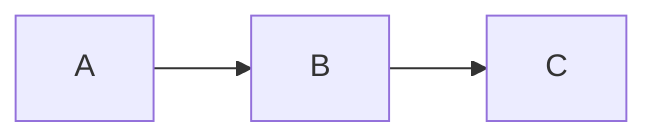

# Doc Review v2 Implementation Plan

> **For agentic workers:** REQUIRED SUB-SKILL: Use superpowers:subagent-driven-development (recommended) or superpowers:executing-plans to implement this plan task-by-task. Steps use checkbox (`- [ ]`) syntax for tracking.

**Goal:** Rewrite the doc-review skill to remove AI suggestion generation, add light reading theme with Markdown rendering, and preserve the prompt loop.

**Architecture:** Single-file HTML playground generated by a Node.js build script. Libraries (marked.js, highlight.js, mermaid.min.js) are inlined for offline use. Event delegation pattern for all interactions. Python generates JSON, Node builds HTML.

**Tech Stack:** HTML/CSS/JS (single-file), marked.js, highlight.js, mermaid.js, Node.js build script, Python JSON generator

**Spec:** `docs/superpowers/specs/2026-05-30-doc-review-v2-design.md`

---

## File Structure

| File | Action | Responsibility |
|------|--------|---------------|
| `references/marked.min.js` | CREATE | Markdown renderer library (~30KB minified) |
| `references/highlight.min.js` | CREATE | Code syntax highlighter (~50KB minified) |
| `references/review-template.html` | REWRITE | New light theme HTML template with comment-only UI |
| `scripts/build-review-html.js` | SIMPLIFY | Remove suggestion logic, add marked/highlight inlining |
| `SKILL.md` | REWRITE | 4-step simplified flow |
| `references/playground-template.md` | DELETE | No longer needed |

---

### Task 1: Download JS Libraries

**Files:**
- Create: `references/marked.min.js`
- Create: `references/highlight.min.js`

- [ ] **Step 1: Download marked.min.js**

```bash
cd /Users/zhuowentao/Workspace/repos/JoeyAssistant/skill-repo/doc-review
curl -sL https://cdnjs.cloudflare.com/ajax/libs/marked/12.0.1/marked.min.js -o references/marked.min.js
```

- [ ] **Step 2: Download highlight.min.js**

```bash
curl -sL https://cdnjs.cloudflare.com/ajax/libs/highlight.js/11.9.0/highlight.min.js -o references/highlight.min.js
```

- [ ] **Step 3: Verify downloads**

```bash
ls -lh references/marked.min.js references/highlight.min.js
wc -c references/marked.min.js references/highlight.min.js
```

Expected: marked.min.js ~40KB, highlight.min.js ~50KB, both non-empty.

- [ ] **Step 4: Commit**

```bash
git add references/marked.min.js references/highlight.min.js
git commit -m "chore: add marked.js and highlight.js libraries for v2"
```

---

### Task 2: Write New HTML Template

This is the core of the rewrite. The template is a single HTML file with all CSS and JS inlined. Placeholders use `<!-- FILL: ... -->` and `/* FILL: ... */` markers that the build script replaces.

**Files:**
- Rewrite: `references/review-template.html`

- [ ] **Step 1: Write the complete new template**

Write the full file to `references/review-template.html`. The template contains:

**CSS (light theme):**
- CSS variables for the color palette (white/gray/blue/green)
- Header bar styling
- Split layout: `.doc-panel` (flex:7) + `.comment-panel` (width:340px)
- Document line styling with `.doc-line-wrap`, hover state, `.has-comment`, `.active`
- Markdown rendered content styling (h1-h3, p, ul, ol, code, pre, blockquote, table)
- Comment card styling in right panel
- Comment input area at bottom of right panel
- Prompt panel at bottom with copy button

**HTML structure:**
```
Header: logo + filename + round badge + hint + stats
Main: doc-panel (doc-content div) | comment-panel (header + list + input)
Prompt panel: header with copy button + content div
```

**JS (event delegation pattern):**
- State: `{ comments: [], nextId: 1, editingLine: null }`
- `renderDocument()`: Renders DOC_LINES as line-wrapped elements with line numbers
- `renderComments()`: Renders comment cards in right panel
- `updatePrompt()`: Generates prompt text from comments
- `updateAll()`: Calls all three render functions
- Event delegation on `docPanel` for line clicks
- Event delegation on `commentList` for card clicks, edit, delete
- Keyboard shortcuts: Esc cancel, Ctrl+Enter save
- Copy button with clipboard API + fallback

**Placeholder markers:**
- `/* FILL: MARKED_JS */` — inlined marked.min.js
- `/* FILL: HIGHLIGHT_JS */` — inlined highlight.min.js
- `/* FILL: MERMAID_JS */` — inlined mermaid.min.js (kept from v1)
- `/* FILL: MERMAID_INIT */` — mermaid initialize call
- `/* FILL: DOC_LINES */` — document lines array
- `<!-- FILL: doc filename -->` — document filename
- `<!-- FILL: round number -->` — round number
- `<!-- FILL: doc path -->` — document path (for display)
- `<!-- FILL: doc filepath -->` — document path (for prompt)

Write the complete file:

```html
<!DOCTYPE html>
<html lang="zh-CN">
<head>
<meta charset="UTF-8">
<meta name="viewport" content="width=device-width, initial-scale=1.0">
<title>Document Review — <!-- FILL: doc filename --> (round <!-- FILL: round number -->)</title>
<style>
  :root {
    --white: #ffffff;
    --gray-50: #f9fafb; --gray-100: #f3f4f6; --gray-200: #e5e7eb;
    --gray-300: #d1d5db; --gray-400: #9ca3af; --gray-500: #6b7280;
    --gray-600: #4b5563; --gray-700: #374151; --gray-800: #1f2937; --gray-900: #111827;
    --blue: #3b82f6; --blue-light: #eff6ff; --blue-border: #93c5fd;
    --green: #10b981; --green-light: #ecfdf5; --green-border: #6ee7b7;
    --red: #ef4444; --red-light: #fef2f2;
    --purple: #8b5cf6;
    --font-sans: -apple-system, BlinkMacSystemFont, "Segoe UI", "Noto Sans SC", sans-serif;
    --font-mono: "SF Mono", "JetBrains Mono", "Fira Code", Consolas, monospace;
    --radius: 8px;
    --shadow-sm: 0 1px 2px rgba(0,0,0,0.05);
    --shadow-md: 0 4px 6px -1px rgba(0,0,0,0.07), 0 2px 4px -2px rgba(0,0,0,0.05);
  }
  * { margin: 0; padding: 0; box-sizing: border-box; }
  body { font-family: var(--font-sans); background: var(--gray-50); color: var(--gray-800); height: 100vh; display: flex; flex-direction: column; overflow: hidden; }

  .header { background: var(--white); border-bottom: 1px solid var(--gray-200); padding: 10px 24px; display: flex; align-items: center; gap: 16px; flex-shrink: 0; box-shadow: var(--shadow-sm); z-index: 10; }
  .header .logo { display: flex; align-items: center; gap: 8px; font-size: 15px; font-weight: 700; color: var(--gray-900); }
  .header .logo .icon { width: 28px; height: 28px; background: linear-gradient(135deg, var(--blue), var(--purple)); border-radius: 6px; display: flex; align-items: center; justify-content: center; color: white; font-size: 14px; font-weight: 700; }
  .header .file-info { display: flex; align-items: center; gap: 8px; font-size: 13px; color: var(--gray-500); }
  .header .file-info .filename { font-family: var(--font-mono); font-size: 12px; background: var(--gray-100); padding: 2px 8px; border-radius: 4px; }
  .header .file-info .round-badge { background: var(--blue-light); color: var(--blue); padding: 2px 8px; border-radius: 10px; font-size: 11px; font-weight: 600; }
  .header .spacer { flex: 1; }
  .header .hint { font-size: 12px; color: var(--gray-400); }
  .header .hint kbd { background: var(--gray-100); border: 1px solid var(--gray-200); padding: 1px 5px; border-radius: 3px; font-family: var(--font-mono); font-size: 11px; color: var(--gray-600); }
  .stats { display: flex; gap: 16px; font-size: 12px; }
  .stat { display: flex; align-items: center; gap: 5px; color: var(--gray-500); }
  .stat .dot { width: 7px; height: 7px; border-radius: 50%; background: var(--blue); }
  .stat .count { font-weight: 600; color: var(--gray-700); }

  .main { flex: 1; display: flex; overflow: hidden; }

  .doc-panel { flex: 7; overflow-y: auto; background: var(--white); border-right: 1px solid var(--gray-200); }
  .doc-panel::-webkit-scrollbar { width: 6px; }
  .doc-panel::-webkit-scrollbar-thumb { background: var(--gray-300); border-radius: 3px; }
  .doc-panel::-webkit-scrollbar-thumb:hover { background: var(--gray-400); }
  .doc-content { max-width: 780px; margin: 0 auto; padding: 32px 40px 60px; }

  .doc-line-wrap { position: relative; padding: 2px 0 2px 52px; border-left: 3px solid transparent; transition: background 0.12s, border-color 0.12s; cursor: pointer; border-radius: 0 4px 4px 0; }
  .doc-line-wrap:hover { background: var(--blue-light); border-left-color: var(--blue-border); }
  .doc-line-wrap.has-comment { background: var(--blue-light); border-left-color: var(--blue); }
  .doc-line-wrap.active { background: #dbeafe; border-left-color: var(--blue); }
  .doc-line-wrap .line-num { position: absolute; left: 0; top: 2px; width: 48px; text-align: right; padding-right: 12px; font-family: var(--font-mono); font-size: 11px; color: var(--gray-400); user-select: none; }
  .doc-line-wrap:hover .line-num { color: var(--gray-500); }
  .doc-line-wrap .line-content > *:first-child { margin-top: 0 !important; }
  .doc-line-wrap .line-content > *:last-child { margin-bottom: 0 !important; }
  .doc-line-wrap .line-content h1 { font-size: 26px; font-weight: 700; color: var(--gray-900); margin: 0 0 8px; padding-bottom: 12px; border-bottom: 1px solid var(--gray-200); line-height: 1.3; }
  .doc-line-wrap .line-content h2 { font-size: 20px; font-weight: 600; color: var(--gray-900); margin: 28px 0 12px; line-height: 1.4; }
  .doc-line-wrap .line-content h3 { font-size: 16px; font-weight: 600; color: var(--gray-800); margin: 20px 0 8px; }
  .doc-line-wrap .line-content p { font-size: 15px; line-height: 1.75; color: var(--gray-700); margin: 0 0 12px; }
  .doc-line-wrap .line-content code { font-family: var(--font-mono); font-size: 13px; background: var(--gray-100); padding: 2px 6px; border-radius: 4px; color: var(--purple); }
  .doc-line-wrap .line-content pre { background: var(--gray-800); border-radius: var(--radius); padding: 16px 20px; margin: 0 0 16px; overflow-x: auto; border: 1px solid var(--gray-700); }
  .doc-line-wrap .line-content pre code { background: none; color: #e5e7eb; padding: 0; font-size: 13px; line-height: 1.6; }
  .doc-line-wrap .line-content blockquote { border-left: 3px solid var(--blue); background: var(--blue-light); padding: 12px 16px; margin: 0 0 12px; border-radius: 0 var(--radius) var(--radius) 0; color: var(--gray-700); font-size: 14px; }
  .doc-line-wrap .line-content table { width: 100%; border-collapse: collapse; margin: 0 0 16px; font-size: 14px; }
  .doc-line-wrap .line-content th { background: var(--gray-50); font-weight: 600; text-align: left; padding: 10px 12px; border: 1px solid var(--gray-200); color: var(--gray-700); }
  .doc-line-wrap .line-content td { padding: 8px 12px; border: 1px solid var(--gray-200); color: var(--gray-600); }
  .doc-line-wrap .line-content strong { color: var(--gray-900); font-weight: 600; }
  .doc-line-wrap .line-content ul, .doc-line-wrap .line-content ol { margin: 0 0 12px; padding-left: 24px; font-size: 15px; line-height: 1.75; color: var(--gray-700); }
  .doc-line-wrap .line-content li { margin-bottom: 4px; }
  .doc-line-wrap .line-content hr { border: none; border-top: 1px solid var(--gray-200); margin: 24px 0; }
  .doc-line-wrap .line-content a { color: var(--blue); text-decoration: none; }
  .doc-line-wrap .line-content a:hover { text-decoration: underline; }
  .doc-line-wrap .line-content .mermaid-block { background: var(--gray-50); border: 1px solid var(--gray-200); border-radius: var(--radius); padding: 16px; margin: 8px 0; }
  .doc-line-wrap .line-content pre.mermaid { background: var(--gray-50); border: 1px solid var(--gray-200); }

  .comment-panel { width: 340px; flex-shrink: 0; background: var(--gray-50); display: flex; flex-direction: column; border-left: 1px solid var(--gray-200); }
  .comment-panel-header { padding: 16px 20px; border-bottom: 1px solid var(--gray-200); background: var(--white); }
  .comment-panel-header h3 { font-size: 14px; font-weight: 600; color: var(--gray-800); display: flex; align-items: center; gap: 6px; }
  .comment-panel-header h3 .badge { background: var(--blue); color: white; font-size: 11px; padding: 1px 7px; border-radius: 10px; font-weight: 600; }
  .comment-list { flex: 1; overflow-y: auto; padding: 12px; }
  .comment-list::-webkit-scrollbar { width: 4px; }
  .comment-list::-webkit-scrollbar-thumb { background: var(--gray-300); border-radius: 2px; }
  .comment-card { background: var(--white); border: 1px solid var(--gray-200); border-radius: var(--radius); padding: 12px; margin-bottom: 8px; cursor: pointer; transition: border-color 0.15s, box-shadow 0.15s; box-shadow: var(--shadow-sm); }
  .comment-card:hover { border-color: var(--blue-border); box-shadow: var(--shadow-md); }
  .comment-card.active { border-color: var(--blue); box-shadow: 0 0 0 2px rgba(59,130,246,0.15); }
  .comment-card .card-line-ref { font-family: var(--font-mono); font-size: 11px; color: var(--blue); background: var(--blue-light); padding: 2px 6px; border-radius: 3px; display: inline-block; margin-bottom: 6px; }
  .comment-card .card-excerpt { font-family: var(--font-mono); font-size: 11px; color: var(--gray-400); white-space: nowrap; overflow: hidden; text-overflow: ellipsis; margin-bottom: 6px; }
  .comment-card .card-text { font-size: 13px; line-height: 1.5; color: var(--gray-700); }
  .comment-card .card-actions { display: flex; gap: 6px; margin-top: 8px; }
  .comment-card .card-actions button { padding: 3px 8px; border-radius: 4px; font-size: 11px; border: 1px solid var(--gray-200); background: var(--white); color: var(--gray-500); cursor: pointer; transition: all 0.15s; }
  .comment-card .card-actions button:hover { border-color: var(--gray-300); color: var(--gray-700); }
  .comment-card .card-actions button.del-btn:hover { border-color: var(--red); color: var(--red); background: var(--red-light); }
  .comment-empty { text-align: center; padding: 40px 20px; color: var(--gray-400); font-size: 13px; }
  .comment-empty .empty-icon { font-size: 32px; margin-bottom: 8px; }
  .comment-input-area { border-top: 1px solid var(--gray-200); background: var(--white); padding: 12px; }
  .comment-input-area .input-label { font-size: 12px; color: var(--gray-500); margin-bottom: 6px; }
  .comment-input-area .input-label .line-ref { font-family: var(--font-mono); color: var(--blue); font-weight: 600; }
  .comment-input-area textarea { width: 100%; border: 1px solid var(--gray-200); border-radius: var(--radius); padding: 8px 10px; font-size: 13px; font-family: var(--font-sans); color: var(--gray-800); resize: vertical; min-height: 60px; transition: border-color 0.15s; }
  .comment-input-area textarea:focus { outline: none; border-color: var(--blue); box-shadow: 0 0 0 2px rgba(59,130,246,0.1); }
  .comment-input-area textarea::placeholder { color: var(--gray-400); }
  .comment-input-area .input-actions { display: flex; justify-content: flex-end; gap: 6px; margin-top: 6px; }
  .comment-input-area .input-actions button { padding: 5px 14px; border-radius: var(--radius); font-size: 12px; font-weight: 500; cursor: pointer; border: 1px solid var(--gray-200); background: var(--white); color: var(--gray-600); transition: all 0.15s; }
  .comment-input-area .input-actions .save-btn { background: var(--blue); color: white; border-color: var(--blue); }
  .comment-input-area .input-actions .save-btn:hover { background: #2563eb; }
  .comment-input-area .input-actions .cancel-btn:hover { background: var(--gray-50); }

  .prompt-panel { border-top: 1px solid var(--gray-200); background: var(--white); flex-shrink: 0; max-height: 200px; display: flex; flex-direction: column; }
  .prompt-header { display: flex; align-items: center; padding: 8px 20px; border-bottom: 1px solid var(--gray-100); flex-shrink: 0; }
  .prompt-header span { font-size: 12px; font-weight: 600; color: var(--gray-500); text-transform: uppercase; letter-spacing: 0.5px; }
  .copy-btn { margin-left: auto; padding: 4px 12px; border-radius: var(--radius); font-size: 12px; cursor: pointer; border: 1px solid var(--gray-200); background: var(--white); color: var(--gray-500); transition: all 0.15s; font-weight: 500; }
  .copy-btn:hover { border-color: var(--green-border); color: var(--green); background: var(--green-light); }
  .copy-btn.copied { border-color: var(--green); color: var(--green); background: var(--green-light); }
  .prompt-content { flex: 1; overflow-y: auto; padding: 10px 20px; font-size: 12px; line-height: 1.6; white-space: pre-wrap; font-family: var(--font-mono); color: var(--gray-600); }
  .prompt-content::-webkit-scrollbar { width: 4px; }
  .prompt-content::-webkit-scrollbar-thumb { background: var(--gray-300); border-radius: 2px; }
  .prompt-content .placeholder { color: var(--gray-400); font-style: italic; font-family: var(--font-sans); }
</style>
</head>
<body>
<div class="header">
  <div class="logo"><div class="icon">R</div> Doc Review</div>
  <div class="file-info">
    <span class="filename"><!-- FILL: doc path --></span>
    <span class="round-badge">Round <!-- FILL: round number --></span>
  </div>
  <div class="spacer"></div>
  <span class="hint">点击任意行添加评论 &middot; <kbd>Esc</kbd> 取消 &middot; <kbd>Ctrl+Enter</kbd> 保存</span>
  <div class="stats">
    <div class="stat"><div class="dot"></div><span class="count" id="stat-comments">0</span> comments</div>
  </div>
</div>
<div class="main">
  <div class="doc-panel" id="docPanel">
    <div class="doc-content" id="docContent"></div>
  </div>
  <div class="comment-panel">
    <div class="comment-panel-header">
      <h3>💬 Comments <span class="badge" id="commentCount">0</span></h3>
    </div>
    <div class="comment-list" id="commentList">
      <div class="comment-empty"><div class="empty-icon">📝</div>点击文档中的任意行来添加评论</div>
    </div>
    <div class="comment-input-area" id="commentInputArea" style="display:none;">
      <div class="input-label">评论 on <span class="line-ref" id="inputLineRef">Line 1</span></div>
      <textarea id="commentTextarea" placeholder="输入你的评论..."></textarea>
      <div class="input-actions">
        <button class="cancel-btn" id="cancelBtn">取消</button>
        <button class="save-btn" id="saveBtn">保存评论</button>
      </div>
    </div>
  </div>
</div>
<div class="prompt-panel">
  <div class="prompt-header">
    <span>Prompt Output</span>
    <button class="copy-btn" id="copyBtn">Copy</button>
  </div>
  <div class="prompt-content" id="promptContent"><div class="placeholder">添加评论后，prompt 会在这里自动生成...</div></div>
</div>

<script>/* FILL: MARKED_JS */</script>
<script>/* FILL: HIGHLIGHT_JS */</script>
<script>/* FILL: MERMAID_JS */</script>
<script>
/* FILL: MERMAID_INIT */

const DOC_LINES = [
/* FILL: DOC_LINES */
];

// --- State ---
const state = { comments: [], nextId: 1, editingLine: null, activeCommentId: null };

// --- Helpers ---
function escapeHtml(str) { const d = document.createElement('div'); d.textContent = str; return d.innerHTML; }
function scrollToLine(n) { const el = document.querySelector('.doc-line-wrap[data-line="' + n + '"]'); if (el) el.scrollIntoView({ behavior: 'smooth', block: 'center' }); }

// --- Rendering ---
function renderDocument() {
  const content = document.getElementById('docContent');
  let html = '';
  let inCodeBlock = false;
  let inMermaid = false;
  let mermaidLines = [];
  let mermaidStartLine = 0;

  DOC_LINES.forEach(function(line, i) {
    const lineNum = i + 1;
    const trimmed = line.trim();
    const hasComment = state.comments.some(function(c) { return c.lineNum === lineNum; });
    const isActive = state.editingLine === lineNum;
    let cls = 'doc-line-wrap';
    if (hasComment) cls += ' has-comment';
    if (isActive) cls += ' active';

    // Mermaid blocks
    if (inMermaid) {
      if (trimmed.startsWith('```')) {
        html += '<div class="' + cls + '" data-line="' + mermaidStartLine + '"><span class="line-num">' + mermaidStartLine + '</span>';
        html += '<div class="line-content"><pre class="mermaid">' + escapeHtml(mermaidLines.join('\n')) + '</pre></div></div>';
        inMermaid = false; mermaidLines = [];
        if (typeof mermaid !== 'undefined') mermaid.run();
      } else { mermaidLines.push(line); }
      return;
    }
    if (trimmed === '```mermaid') { inMermaid = true; mermaidStartLine = lineNum; return; }

    // Code blocks
    if (trimmed.startsWith('```')) { inCodeBlock = !inCodeBlock; }

    // Render line content via marked
    let rendered = marked.parse(line || '\n', { gfm: true, breaks: true });

    // Strip wrapping <p> for non-paragraph lines to avoid extra spacing
    if (line.startsWith('# ') || line.startsWith('## ') || line.startsWith('### ') ||
        line.startsWith('- ') || line.startsWith('> ') || line.startsWith('| ') ||
        line.startsWith('|-') || line.trim() === '' || trimmed.startsWith('```')) {
      rendered = rendered.replace(/^<p>(.*?)<\/p>\s*$/s, '$1');
    }

    html += '<div class="' + cls + '" data-line="' + lineNum + '">';
    html += '<span class="line-num">' + lineNum + '</span>';
    html += '<div class="line-content">' + rendered + '</div>';
    html += '</div>';
  });

  content.innerHTML = html;

  // Syntax highlight code blocks
  if (typeof hljs !== 'undefined') {
    content.querySelectorAll('pre code').forEach(function(block) { hljs.highlightElement(block); });
  }
}

function renderComments() {
  const list = document.getElementById('commentList');
  document.getElementById('commentCount').textContent = state.comments.length;
  document.getElementById('stat-comments').textContent = state.comments.length;

  if (state.comments.length === 0) {
    list.innerHTML = '<div class="comment-empty"><div class="empty-icon">📝</div>点击文档中的任意行来添加评论</div>';
    return;
  }

  let html = '';
  state.comments.forEach(function(c) {
    var lt = DOC_LINES[c.lineNum - 1] || '';
    var excerpt = lt.substring(0, 50).trim() + (lt.length > 50 ? '...' : '');
    var isActive = state.activeCommentId === c.id;
    html += '<div class="comment-card' + (isActive ? ' active' : '') + '" data-id="' + c.id + '" data-line="' + c.lineNum + '">';
    html += '<div class="card-line-ref">Line ' + c.lineNum + '</div>';
    html += '<div class="card-excerpt">' + escapeHtml(excerpt) + '</div>';
    html += '<div class="card-text">' + escapeHtml(c.text) + '</div>';
    html += '<div class="card-actions"><button data-edit="' + c.id + '">编辑</button><button class="del-btn" data-del="' + c.id + '">删除</button></div>';
    html += '</div>';
  });
  list.innerHTML = html;
}

function updatePrompt() {
  var el = document.getElementById('promptContent');
  if (state.comments.length === 0) {
    el.innerHTML = '<div class="placeholder">添加评论后，prompt 会在这里自动生成...</div>';
    return;
  }
  var prompt = '请更新 `<!-- FILL: doc filepath -->`，按照以下评论进行修改：\n\n## My Comments\n\n';
  state.comments.forEach(function(c) {
    var lt = DOC_LINES[c.lineNum - 1] || '';
    prompt += '- **Line ' + c.lineNum + '** (`' + lt.substring(0, 50).trim() + (lt.length > 50 ? '...' : '') + '`):\n  ' + c.text + '\n\n';
  });
  el.textContent = prompt;
}

function updateAll() { renderDocument(); renderComments(); updatePrompt(); }

// --- Actions ---
function openCommentInput(lineNum) {
  state.editingLine = lineNum;
  var area = document.getElementById('commentInputArea');
  area.style.display = 'block';
  document.getElementById('inputLineRef').textContent = 'Line ' + lineNum;
  var textarea = document.getElementById('commentTextarea');
  textarea.value = '';
  textarea.placeholder = '输入你对 Line ' + lineNum + ' 的评论...';
  renderDocument();
  textarea.focus();
}

function closeCommentInput() {
  state.editingLine = null;
  document.getElementById('commentInputArea').style.display = 'none';
  renderDocument();
}

function saveComment() {
  var textarea = document.getElementById('commentTextarea');
  var text = textarea.value.trim();
  if (!text || !state.editingLine) return;
  var existing = state.comments.find(function(c) { return c.lineNum === state.editingLine; });
  if (existing) { existing.text = text; }
  else { state.comments.push({ id: state.nextId++, lineNum: state.editingLine, text: text }); }
  state.editingLine = null;
  document.getElementById('commentInputArea').style.display = 'none';
  updateAll();
}

function deleteComment(id) {
  state.comments = state.comments.filter(function(c) { return c.id !== id; });
  if (state.activeCommentId === id) state.activeCommentId = null;
  updateAll();
}

// --- Event Delegation ---
document.getElementById('docPanel').addEventListener('click', function(e) {
  var lineEl = e.target.closest('.doc-line-wrap');
  if (!lineEl) return;
  e.stopPropagation();
  openCommentInput(parseInt(lineEl.dataset.line));
});

document.getElementById('commentList').addEventListener('click', function(e) {
  var delBtn = e.target.closest('[data-del]');
  if (delBtn) { e.stopPropagation(); deleteComment(parseInt(delBtn.dataset.del)); return; }
  var editBtn = e.target.closest('[data-edit]');
  if (editBtn) {
    e.stopPropagation();
    var id = parseInt(editBtn.dataset.edit);
    var comment = state.comments.find(function(c) { return c.id === id; });
    if (comment) { openCommentInput(comment.lineNum); document.getElementById('commentTextarea').value = comment.text; }
    return;
  }
  var card = e.target.closest('.comment-card');
  if (card) { state.activeCommentId = parseInt(card.dataset.id); scrollToLine(parseInt(card.dataset.line)); renderComments(); }
});

document.getElementById('saveBtn').addEventListener('click', saveComment);
document.getElementById('cancelBtn').addEventListener('click', closeCommentInput);
document.addEventListener('keydown', function(e) {
  if (e.key === 'Escape' && state.editingLine) closeCommentInput();
  if (e.key === 'Enter' && (e.ctrlKey || e.metaKey) && state.editingLine) { e.preventDefault(); saveComment(); }
});
document.getElementById('copyBtn').addEventListener('click', function() {
  var text = document.getElementById('promptContent').textContent;
  function onSuccess() { var btn = document.getElementById('copyBtn'); btn.textContent = 'Copied!'; btn.classList.add('copied'); setTimeout(function() { btn.textContent = 'Copy'; btn.classList.remove('copied'); }, 1500); }
  function fallback() { var ta = document.createElement('textarea'); ta.value = text; ta.style.position = 'fixed'; ta.style.left = '-9999px'; document.body.appendChild(ta); ta.select(); try { document.execCommand('copy'); onSuccess(); } catch(e) {} document.body.removeChild(ta); }
  if (navigator.clipboard && window.isSecureContext) { navigator.clipboard.writeText(text).then(onSuccess, fallback); } else { fallback(); }
});

updateAll();
</script>
</body>
</html>
```

- [ ] **Step 2: Commit**

```bash
git add references/review-template.html
git commit -m "feat: rewrite review template with light theme and comment-only UI"
```

---

### Task 3: Simplify Build Script

**Files:**
- Modify: `scripts/build-review-html.js`

- [ ] **Step 1: Rewrite build-review-html.js**

The new build script:
- Accepts JSON with `{ docPath, round, docLines }` (no suggestions)
- Inlines marked.min.js, highlight.min.js, and mermaid.min.js
- Replaces all `<!-- FILL: ... -->` and `/* FILL: ... */` placeholders
- Validates JS syntax
- Preserves headless server mode (`--serve` flag)
- Preserves line count verification

Write the complete file:

```javascript
#!/usr/bin/env node
'use strict';

const fs = require('fs');
const path = require('path');
const { execSync, spawn } = require('child_process');
const os = require('os');
const http = require('http');

const args = process.argv.slice(2);
const serveMode = args.includes('--serve');
if (serveMode) args.splice(args.indexOf('--serve'), 1);

if (args.length < 1) {
  console.error('Usage: node build-review-html.js [--serve] <input.json> [output.html]');
  console.error('');
  console.error('Options:');
  console.error('  --serve    Auto-detect environment and open/serve the HTML');
  console.error('');
  console.error('Input JSON format:');
  console.error('  {');
  console.error('    "docPath": "path/to/doc.md",');
  console.error('    "round": 1,');
  console.error('    "docLines": ["line1", "line2", ...]');
  console.error('  }');
  process.exit(1);
}

const inputPath = path.resolve(args[0]);
const outputPath = args[1] ? path.resolve(args[1]) : inputPath.replace(/\.json$/, '.html');
const scriptDir = __dirname;

// Read and parse input
let input;
try {
  input = JSON.parse(fs.readFileSync(inputPath, 'utf8'));
} catch (e) {
  console.error('Failed to read/parse input JSON:', e.message);
  process.exit(1);
}

const { docPath, docLines, round = 1 } = input;

if (!docPath || !Array.isArray(docLines)) {
  console.error('Input must have docPath (string) and docLines (array)');
  process.exit(1);
}

// Read the HTML template
const templatePath = path.join(scriptDir, '..', 'references', 'review-template.html');
let template;
try {
  template = fs.readFileSync(templatePath, 'utf8');
} catch (e) {
  console.error('Failed to read template:', templatePath, e.message);
  process.exit(1);
}

// Read JS libraries for inlining
function readLib(name, filename) {
  const libPath = path.join(scriptDir, '..', 'references', filename);
  try {
    const content = fs.readFileSync(libPath, 'utf8');
    console.log(name + ': loaded (' + Math.round(content.length / 1024) + ' KB)');
    return content;
  } catch (e) {
    console.warn('Warning: ' + filename + ' not found at', libPath);
    return '';
  }
}

const markedJs = readLib('marked.js', 'marked.min.js');
const highlightJs = readLib('highlight.js', 'highlight.min.js');
const mermaidJs = readLib('mermaid.js', 'mermaid.min.js');

// Escape for JS single-quoted string
function escJs(str) {
  return String(str).replace(/\\/g, '\\\\').replace(/'/g, "\\'").replace(/\n/g, '\\n').replace(/\r/g, '\\r');
}

// Build DOC_LINES JS array
const docLinesJs = docLines.map(function(l) { return "  '" + escJs(l) + "'"; }).join(',\n');

// Mermaid init
const mermaidInit = mermaidJs
  ? "mermaid.initialize({startOnLoad:false,theme:'default',securityLevel:'loose'});"
  : '/* mermaid not available */';

// Replace placeholders
const html = template
  .replace(/\/\* FILL: MARKED_JS \*\//, function() { return markedJs || '/* marked not loaded */'; })
  .replace(/\/\* FILL: HIGHLIGHT_JS \*\//, function() { return highlightJs || '/* highlight not loaded */'; })
  .replace(/\/\* FILL: MERMAID_JS \*\//, function() { return mermaidJs || '/* mermaid not loaded */'; })
  .replace(/\/\* FILL: MERMAID_INIT \*\//, function() { return mermaidInit; })
  .replace(/<!-- FILL: doc filename -->/g, function() { return path.basename(docPath); })
  .replace(/<!-- FILL: round number -->/g, function() { return String(round); })
  .replace(/<!-- FILL: doc path -->/g, function() { return escJs(docPath); })
  .replace(/<!-- FILL: doc filepath -->/g, function() { return escJs(docPath); })
  .replace(/\/\* FILL: DOC_LINES \*\//, function() { return docLinesJs; });

// Validate JS syntax
try {
  const scriptMatches = [...html.matchAll(/<script>([\s\S]*?)<\/script>/g)];
  for (const match of scriptMatches) {
    const code = match[1];
    if (code.length > 200000 || code.trim().length < 50) continue;
    new Function(code);
  }
  console.log('JS syntax validation: OK');
} catch (e) {
  console.error('JS syntax error in generated HTML:', e.message);
}

// Write output
fs.writeFileSync(outputPath, html, 'utf8');

// Line count verification
const htmlLinesMatch = html.match(/const DOC_LINES = \[([\s\S]*?)\];/);
if (htmlLinesMatch) {
  const htmlLineCount = htmlLinesMatch[1].split("',\n").length;
  if (htmlLineCount !== docLines.length) {
    console.warn('WARNING: line count mismatch. Source: ' + docLines.length + ', HTML: ' + htmlLineCount);
  } else {
    console.log('Line count verification: OK (' + docLines.length + ' lines)');
  }
}

console.log('Generated: ' + outputPath);
console.log('Document: ' + docPath + ' (' + docLines.length + ' lines, round ' + round + ')');

// Serve or open
if (serveMode) {
  const filename = path.basename(outputPath);
  const dir = path.dirname(outputPath);

  if (process.platform === 'darwin') {
    try { execSync('open "' + outputPath + '"', { stdio: 'inherit' }); console.log('Opened in browser (macOS)'); }
    catch (e) { console.error('Failed to open browser:', e.message); }
  } else if (process.env.DISPLAY && hasCommand('xdg-open')) {
    try { execSync('xdg-open "' + outputPath + '"', { stdio: 'inherit' }); console.log('Opened in browser (Linux GUI)'); }
    catch (e) { console.error('Failed to open browser:', e.message); }
  } else {
    serveWithPython(dir, filename);
  }
}

function hasCommand(cmd) {
  try { execSync('which ' + cmd + ' 2>/dev/null', { encoding: 'utf8' }); return true; }
  catch { return false; }
}

function serveWithPython(dir, filename) {
  const port = findAvailablePort(8123, 8999);
  const interfaces = os.networkInterfaces();
  const ips = [];
  for (const name of Object.keys(interfaces)) {
    for (const iface of interfaces[name]) {
      if (iface.family === 'IPv4' && !iface.internal) ips.push(iface.address);
    }
  }
  const pythonCmd = hasCommand('python3') ? 'python3' : (hasCommand('python') ? 'python' : null);
  if (!pythonCmd) { console.error('No Python found. Cannot start HTTP server.'); console.log('File is at: ' + path.join(dir, filename)); return; }
  const server = spawn(pythonCmd, ['-m', 'http.server', String(port)], { cwd: dir, stdio: ['pipe', 'pipe', 'pipe'], detached: false });
  console.log('\n=== HTTP Server Started (headless Linux) ===');
  console.log('Open in your browser:');
  console.log('  http://localhost:' + port + '/' + filename);
  for (const ip of ips) console.log('  http://' + ip + ':' + port + '/' + filename);
  console.log('Press Ctrl+C to stop the server.\n');
  server.stdout.on('data', function(data) { var msg = data.toString().trim(); if (msg) console.log('[http]', msg); });
  server.stderr.on('data', function(data) { var msg = data.toString().trim(); if (msg && !msg.includes('Serving HTTP')) console.log('[http]', msg); });
  process.on('SIGINT', function() { server.kill(); process.exit(0); });
  process.on('SIGTERM', function() { server.kill(); process.exit(0); });
  server.on('close', function() { process.exit(0); });
}

function findAvailablePort(start, end) {
  for (var p = start; p <= end; p++) {
    try { var s = require('net').createServer(); s.listen(p); s.close(); return p; } catch {}
  }
  return 8080;
}
```

- [ ] **Step 2: Verify script runs without errors**

```bash
echo '{"docPath":"test.md","round":1,"docLines":["# Test","Hello world"]}' > /tmp/test-review.json
node scripts/build-review-html.js /tmp/test-review.json /tmp/test-review.html
```

Expected output: `marked.js: loaded`, `highlight.js: loaded`, `mermaid.js: loaded`, `JS syntax validation: OK`, `Line count verification: OK (2 lines)`, `Generated: /tmp/test-review.html`.

- [ ] **Step 3: Commit**

```bash
git add scripts/build-review-html.js
git commit -m "refactor: simplify build script, add marked/highlight inlining, remove suggestion logic"
```

---

### Task 4: Rewrite SKILL.md

**Files:**
- Rewrite: `SKILL.md`

- [ ] **Step 1: Write the new SKILL.md**

```markdown
---
name: doc-review
description: Use when the user needs to review a document, design spec, or any text artifact and wants to provide structured feedback through an interactive playground. Triggers include "review this doc", "我来review", "帮我看看这个文档", generating a document that needs user approval before finalizing, or any iterative document review workflow. Also use after generating a design doc, data schema, API spec, or similar artifact that requires user sign-off.
---

# Interactive Document Review

Generate an interactive HTML playground for reviewing documents. The user reviews in a browser, adds inline comments on any line, copies the generated prompt, and pastes it back for Claude to apply changes. Loop until confirmed.

## Principles

1. **User is in control** — the user decides when the review is complete. Never assume "OK" — always wait for explicit confirmation.
2. **Preview before destructive changes** — for major structural changes (deleting sections, rewriting content), show a preview first.

## Step-by-step

### 1. Build the playground

Read the target document. Use Python to generate a JSON file, then run the build script.

```bash
python3 -c "
import json
with open('<doc-path>', 'r') as f:
    lines = f.read().splitlines()

data = {
    'docPath': '<doc-path>',
    'round': 1,
    'docLines': lines
}
with open('<doc-dir>/<doc-name>-review.json', 'w') as f:
    json.dump(data, f, ensure_ascii=False, indent=2)
print(f'JSON ready: {len(lines)} lines')
"
```

Then run the build script:

```bash
node ~/.claude/skills/doc-review/scripts/build-review-html.js --serve <doc-dir>/<doc-name>-review.json
```

The script outputs `<doc-name>-review.html` in the same directory.

The `--serve` flag auto-detects the environment:
   - **macOS**: opens in browser with `open`
   - **Linux with GUI** (`$DISPLAY` + `xdg-open`): opens in browser with `xdg-open`
   - **Headless Linux**: starts a Python HTTP server, prints the URL to access from your local browser

### 2. Wait for user feedback

The user reviews in the browser and either:
- Pastes the generated prompt back (has comments to apply)
- Gives explicit completion confirmation

**Keywords that mean "continue"** (skip confirmation check, go to Step 4):
- "继续"、"继续review"、"再来"、"再看看"、"继续看"
- Any response that doesn't contain "确认完成"、"可以了"、"没问题"

When user says "继续", skip to Step 4 immediately.

### 3. Apply changes

Parse the user's pasted prompt and apply each "My Comments" entry to the document.

**Applying strategy — Edit tool vs Python fallback:**

Prefer the Edit tool for small, unique string replacements. When Edit fails twice on the same block, switch to Python line-number replacement:

```bash
python3 << 'PYEOF'
with open('<doc-path>', 'r', encoding='utf-8') as f:
    lines = f.readlines()
start = None
end = None
for i, line in enumerate(lines):
    if '<unique marker>' in line: start = i
    if start is not None and '<end marker>' in line: end = i; break
new_lines = ['### New Content\n', '\n']
lines[start:end+1] = new_lines
with open('<doc-path>', 'w', encoding='utf-8') as f:
    f.writelines(lines)
print(f'Replaced lines {start+1}-{end+1}')
PYEOF
```

**Cross-reference check after renames:**

When a comment renames a field/class/enumeration, grep for ALL occurrences:

```bash
grep -n '<old_name>' <doc-path>
```

### 4. Rebuild playground

After applying changes:
1. Re-read the updated document
2. **Delete any existing review HTML in the doc directory** — stale files cause bugs
3. Write updated JSON and re-run the build script with `--serve`

### 5. Explicit confirmation check

Ask the user to explicitly choose:

```
本次 review 完成了吗？
- 如果还需要修改 → 告诉我具体内容，我会继续
- 如果已完成 → 说"确认完成"，我会删除临时文件并结束
```

**Only these phrases trigger cleanup and exit:**
- "确认完成"、"可以了"、"没问题"、"完成了"

**Everything else is "continue"** — rebuild and loop (Step 4).

Repeat steps 2-4 until user explicitly confirms completion.

## When NOT to use this skill

- Simple typo fixes or one-line changes (just edit directly)
- Documents the user is still actively drafting (review comes after drafting)
- Non-text artifacts (images, binary files)
```

- [ ] **Step 2: Commit**

```bash
git add SKILL.md
git commit -m "docs: rewrite SKILL.md with 4-step simplified flow"
```

---

### Task 5: Delete playground-template.md

**Files:**
- Delete: `references/playground-template.md`

- [ ] **Step 1: Delete the file**

```bash
rm references/playground-template.md
```

- [ ] **Step 2: Commit**

```bash
git add -u references/playground-template.md
git commit -m "chore: remove obsolete playground-template.md"
```

---

### Task 6: End-to-End Smoke Test

**Files:**
- No file changes — verification only

- [ ] **Step 1: Create a test document with varied Markdown content**

```bash
cat > /tmp/smoke-test-doc.md << 'EOF'
# Test Document

## Overview

This is a **test document** with `inline code` and [a link](https://example.com).

## Code Example

```python
def hello():
    print("Hello, World!")
```

## Table

| Name | Value |
|------|-------|
| A    | 1     |
| B    | 2     |

## Mermaid



## List

- Item 1
- Item 2
- Item 3
EOF
```

- [ ] **Step 2: Generate JSON and build HTML**

```bash
python3 -c "
import json
with open('/tmp/smoke-test-doc.md', 'r') as f:
    lines = f.read().splitlines()
data = {'docPath': '/tmp/smoke-test-doc.md', 'round': 1, 'docLines': lines}
with open('/tmp/smoke-test-doc-review.json', 'w') as f:
    json.dump(data, f, ensure_ascii=False, indent=2)
print(f'JSON ready: {len(lines)} lines')
"
node ~/.claude/skills/doc-review/scripts/build-review-html.js --serve /tmp/smoke-test-doc-review.json
```

- [ ] **Step 3: Verify in browser**

Open the generated HTML and check:
1. Light theme renders correctly (white background, dark text)
2. Headings, paragraphs, code blocks, tables render with proper styling
3. Code blocks have syntax highlighting
4. Mermaid diagram renders (if mermaid.min.js is present)
5. Click any line → right panel shows comment input
6. Add comments → right panel shows comment cards
7. Prompt panel auto-generates with line references
8. Copy button works
9. Edit and delete comments work
10. Multiple comments on different lines work

- [ ] **Step 4: Clean up temp files**

```bash
rm -f /tmp/smoke-test-doc.md /tmp/smoke-test-doc-review.json /tmp/smoke-test-doc-review.html
```

---

## Self-Review

**1. Spec coverage check:**
- ✅ Remove AI suggestions → Task 2 (no suggestion code in template), Task 3 (no suggestion validation), Task 4 (no suggestion step)
- ✅ Light reading mode → Task 2 (CSS variables)
- ✅ Split panel layout → Task 2 (HTML structure)
- ✅ Markdown rendering → Task 1 (marked.js), Task 2 (marked.parse in JS)
- ✅ Comment-only UI → Task 2 (event delegation, comment state)
- ✅ Mermaid support → Task 2 (mermaid block detection), Task 3 (inlining)
- ✅ Headless server → Task 3 (serveWithPython preserved)
- ✅ Prompt loop → Task 4 (SKILL.md flow)
- ✅ Delete playground-template.md → Task 5

**2. Placeholder scan:** No TBD/TODO/fill-in-later found. All code is complete.

**3. Type consistency:** State object uses `{ id, lineNum, text }` consistently across all functions. DOM data attributes `data-line`, `data-id`, `data-edit`, `data-del` used consistently in both rendering and event delegation.
