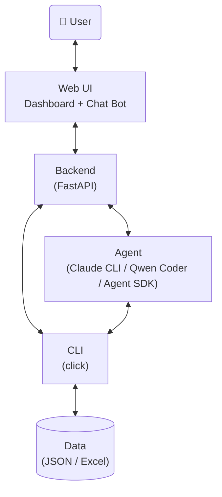

# AI agent设计
## 架构



**调用链路：**

| 场景 | 路径 |
|------|------|
| 标准 CRUD | User → Web UI → Backend → CLI → Data |
| 自然语言查询 | User → Web UI(Chat Bot) → Backend → Agent → CLI → Data |
| Agent 分析 | Agent → CLI → Data（Agent 直接调用 CLI 获取数据） |

## Web UI设计
### UI功能
<从用户使用角度出发，梳理出UI需要提供的功能>

### UI设计
<界面、布局、控件、交互设计>

### UX设计
<关注用户体验>

## backend设计
### 设计原则
- 混合模式：标准 CRUD 直接走 CLI，分析/自然语言走 Agent
- 提供 RESTful 风格API，与 CLI 命令一一对应
- API Server 薄层封装，仅包含必要业务逻辑

```
Web UI → API Server(FastAPI) ┬→ CLI（标准 CRUD）→ Data(JSON)
                              └→ Agent（分析/自然语言）→ CLI → Data
```

### API设计

## agent设计
- 基于claude cli或agent SDK

## CLI设计
### 设计原则
- data-oriented: CLI以数据为中心，提供数据相关的操作，如查询、修改、新增、删除等
- `--help as doc`: 具备详细、清晰的命令行帮助文档，开发人员或agent能够根据`--help`内容明确CLI功能、原理、输入输出、使用方法，agent调用脚本之前，必须先查看`--help`
- 结构化输入输出：除了常规CLI的arguments/options，提供json格式输入全量入参，输出格式统一使用json，方便代码或agent解析
- 使用`click`框架
- 使用`dataclass`定义data schema

## CLI命令
<列出cli --help内容>


## Data layer
### 选型原则
优先json、excel等简单持久化格式，对于较复杂的数据结构，考虑使用数据库存储

### Data Schema
<列出data schema定义以及详细描述>
