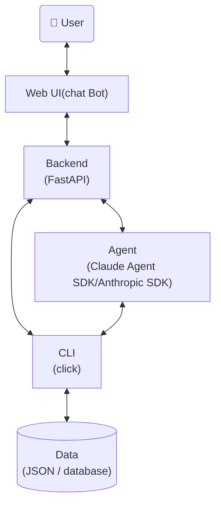

# AI agent design pattern
AI agent设计范式，按照以下章节进行设计与文档输出

## 参考架构



## Web UI设计
### UI设计概念定义
- View(视图)：用户界面，如登录页、主界面、详情页等
- Region (区域)：View内独立功能的区域，如登录表单、资产列表、资产详情等区域
- Element (元素)：Region的UI组件，如button，badge等

### UI功能
<从用户使用角度出发，梳理出用户使用UI界面的场景以及对应的功能>

### UI设计
<列出View -- Region -- Element的设计规格>

### UX设计
<用户体验原则>

### 开发流程
- 使用skill /frontend-design
- 与用户讨论UI设计
- 编写fake UI代码，用户review并确认
- 更新UI设计文档
- 开发UI代码

## backend设计
### 设计原则
- 混合模式：CLI提供的命令直接走 API Server，chatbot自然语言调用Agent处理
- 提供 RESTful 风格API，尽可能与 CLI 命令一一对应
- API Server 薄层封装，仅包含必要业务逻辑

```
Web UI → API Server(FastAPI) ┬→ CLI→ Data(JSON)
                              └→ Agent（分析/自然语言）→ CLI → Data
```

### API设计
<列出API接口定义以及描述，包括每个API的路径，功能描述，输入、输出>

### API时序图
<使用mermaid语法列出API的调用流程，与内部模块（如agent、cli、data layer）的交互流程>

## agent设计
- use Claude SDK (Anthropic SDK) or Claude Agent SDK
- use skill /claude-api

## CLI设计
### 设计原则
- data-oriented: CLI以数据为中心，提供数据相关的操作，如查询、修改、新增、删除等
- `--help as doc`: 具备详细、清晰的命令行帮助文档，开发人员或agent能够根据`--help`内容明确CLI功能、原理、输入输出、使用方法，agent调用脚本之前，必须先查看`--help`
- 结构化输入输出：除了常规CLI的arguments/options，提供json格式输入全量入参，输出格式统一使用json，方便代码或agent解析
- 使用`click`框架
- 使用`dataclass`定义data schema

## CLI命令
<列出cli --help内容>

## Data layer
### 选型原则
优先json、excel等简单持久化格式，对于较复杂的数据结构，考虑使用数据库存储

### Data Schema
<列出data schema定义以及详细描述>

## scripts
创建基本agent部署运维脚本，脚本输出human-friendly
- start.sh
- stop.sh
- restart.sh
- status.sh

## 代码目录结构
```
agent/
cli/
doc/
script/
backend/
frontend/
test/
README.md
```

