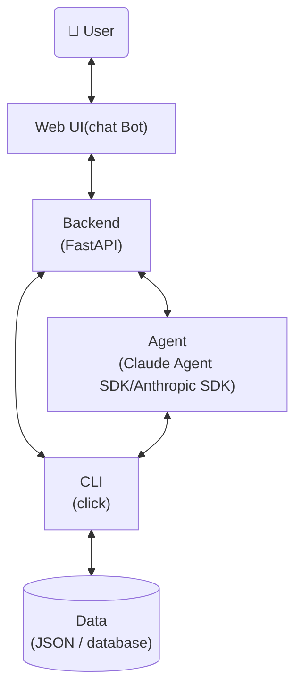

# AI agent design pattern
AI agent设计范式，按照以下章节进行设计与文档输出

## 参考架构


```mermaid
graph TD
    User("👤 User")
    WebUI["Web UI(chat Bot)"]
    Backend["Backend<br/>(FastAPI)"]
    Agent["Agent<br/>(Claude Agent SDK/Anthropic SDK)"]
    CLI["CLI<br/>(click)"]
    Data[("Data<br/>(JSON / database)")]

    User <--> WebUI
    WebUI <--> Backend
    Backend <--> Agent
    Backend <--> CLI
    Agent <--> CLI
    CLI <--> Data
```

## Data layer

### data schema
- 统一在`doc/data-schema.md`中定义基础数据结构
- 结合业务场景，定义简洁、清晰的数据结构，使用合理数据类型，避免过度设计
- 提供`python dataclass`定义，以及相应文字描述
- CLI脚本或backend代码中中直接使用上述定义结构
- `doc/data-schema.md`文档仅承载业务数据结构定义，不体现业务使用代码或持久化内容

### data persistence
- 统一在`doc/data-persistence.md`中定义数据持久化策略，包括文件存储、数据库存储等
- 持久化方案优先使用json、yaml等简单持久化存储，对于较复杂场景，使用数据库方案存储
- `doc/data-persistence.md`仅定义存储方案，不涉及CLI内容

## CLI layer

### CLI设计原则
- `--help as doc`: `doc/cli.md`中列出所有cli的`--help`设计，具备详细、清晰的命令行帮助文档，开发人员或agent能够根据`--help`内容明确CLI功能、原理、输入输出、使用方法，agent调用脚本之前，必须先查看`--help`
- data-oriented: CLI以数据为中心，提供`data layer`数据相关的操作，如查询、修改、新增、删除等，command与入参设计保持精简，避免过度设计
- 结构化输入输出：除了常规CLI的arguments/options，提供json格式输入全量入参，输出格式统一使用json，方便代码或agent解析
- 使用`click`框架
- 使用`dataclass`定义data schema
- 默认使用`python3`

## Agent Layer
- use Claude SDK (Anthropic SDK) or Claude Agent SDK
- use skill /claude-api

## Backend Layer
设计文档`doc/backend.md`内容
- backend技术选型
- REST API设计，针对每一个API，列出接口定义，包括接口功能、输出、输出，使用mermaid语法列出API的调用流程，与内部模块（如agent、cli、data layer）的交互流程

## Web UI设计

### 设计与开发流程
#### 设计先行，所见即所得
- always use skill /frontend-design
- `doc/frontend/`目录下，针对每一个网页，创建对应UI预览`html`文件，用于与用户讨论、修改、确认UI设计规格，使用mock数据
- 开发阶段按照`doc/frontend/`下的网页设计规格，一比一同步至`frontend/`目录下，并完成相关前后端开发
- 每次修改后使用`playwright`验证前端UI修改是否生效，功能正常

## 日志规范

### 打印原则

1. **外部调用必打**：调用外部模块或服务前打印请求参数，调用后打印返回结果与耗时
2. **关键流程节点必打**：业务流程起止、状态变更等关键节点必须记录
3. **异常错误必打**：必须包含错误描述与根因线索
4. **防止日志泛滥**：禁止高频循环逐条打印；高频场景正常成功时不打印，仅异常时记录
5. **敏感信息保护**：禁止输出密码、Token、密钥等敏感信息

### 日志等级

| 等级 | 定义 | 必须包含 |
|------|------|----------|
| ERROR | 影响业务正常运行，需人工介入 | 错误描述、根因线索 |
| WARN | 异常但可自动恢复，不影响主流程 | 异常描述、恢复策略 |
| INFO | 关键业务流程节点与状态变更 | 事件描述、关键参数 |
| DEBUG | 开发调试详细信息，生产环境默认关闭 | 详细上下文变量 |

**通用规则**：
- 重试场景：中间失败打 WARN，最终成功打 INFO 附重试次数，最终失败打 ERROR
- 高频调用：正常成功不打日志，仅异常时打 WARN/ERROR

### 日志格式

- 文本统一使用英文
- 格式：`[时间戳] [等级] [模块名] [类名:函数名] 文本描述, key1=value1, key2=value2`
- 业务相关的 tag 通过记录日志时显式添加（如 traceID、taskID 等）

**示例**：
```
2026-04-07 10:23:45 [ERROR] [agent] [Agent:run] Connect to server failed, host=192.168.1.100, error=ETIMEDOUT
2026-04-07 10:23:46 [INFO] [agent] [Agent:run] Connect succeeded, retryCount=3, latency=422ms
```

### 实现规范

#### Python 模块（Backend / CLI / Agent）

- 使用 Python 标准库 `logging`，不引入额外依赖
- Logger 命名：`logging.getLogger(__name__)`
- 输出目标：同时输出到 stdout 和项目 `log/` 目录，`log/` 加入 `.gitignore`
- 日志轮转：使用 `RotatingFileHandler`，推荐默认策略：单文件 15MB，保留 10 个归档
- 生产环境默认日志等级 INFO，可通过配置调整为 DEBUG

#### Frontend（JavaScript）

- 遵循上述通用原则（等级、打印原则、敏感信息保护）
- 实现方案：基于 `console` 封装，或使用轻量日志库
- 输出到浏览器 console，开发环境可输出到文件（如通过 Browser DevTools）

## scripts
创建基本agent部署运维脚本，要求脚本打印human-friendly output用户阅读
- start.sh
- stop.sh
- restart.sh
- status.sh

## 测试设计

### 测试用例类型

- 单元测试（UT）: 验证子模块或类核心逻辑，mock外部依赖
- 集成测试（IT）: 以用户使用场景为驱动，根据服务实际对外暴露的方式选择测试入口，进行整体前后端端到端功能验证，使用真实依赖。若服务通过 Web UI 对外提供，使用 Playwright 操作浏览器；若服务以 HTTP API 形式暴露，则通过 API 进行测试

### 测试用例运行方式

针对单元测试与集成测试，各自提供执行脚本，自动化全量运行，按模块生成测试报告

```
test/run_ut.py
test/run_it.py
```

### 测试用例编写原则

#### 通用原则（UT与IT）

- 测试数据隔离：测试使用独立数据，与生产数据隔离
- 测试数据与临时文件自清理：测试用例运行生成的临时数据或临时文件，用例运行完成之后需删除
- Bug回归：Bug 修复必须补充对应的回归用例，写入对应模块的测试文件中，用例名标注 `regression` 并说明对应的 bug 描述

#### 单元测试（UT）

- **模块隔离**: 每个模块独立测试，mock 外部模块的函数依赖（如测试 agent 时 mock cli 层数据函数，测试 backend 时 mock cli 和 agent）
- **覆盖范围**:
  - 核心逻辑路径必须覆盖（正常路径 + 异常路径）
  - 关键的数据转换路径必须覆盖（如 dict ↔ dataclass 转换、JSON 序列化/反序列化）
- **测试文件组织**:
  - 按模块创建子目录，以被测源文件为粒度命名: `test/unit/<module>/test_<filename>.py`（如 `test/unit/cli/test_assets.py`、`test/unit/agent/test_agent.py`）
  - 当单个测试文件超过 300 行时，按功能进一步拆分
  - `test/conftest.py`: UT 通用共享 fixture（如临时数据文件、通用测试数据）

#### 集成测试（IT）

- **场景驱动**: 从用户实际使用场景出发，覆盖关键用户操作流程
- **端到端验证**: 根据服务暴露方式选择测试入口（Web UI 使用 Playwright，HTTP API 使用 HTTP 客户端），验证完整链路（Web UI / API → Backend → CLI → Data Layer）
- **环境要求**: 需要启动完整服务（Backend + 前端），Playwright 未安装时自动跳过
- **测试文件组织**:
  - 文件按场景划分: `test/integration/test_<scenario>.py`
  - `test/integration/conftest.py`: 集成测试专用 fixture（如服务启动/停止、Playwright page）

## 代码目录结构
```
agent/
cli/
doc/
    frontend/ # UI设计demo目录
    backend.md
    cli.md # CLI命令定义
    data-schema.md # 数据结构定义
    data-persistence.md # 数据持久化存储设计
script/
backend/
frontend/
test/
README.md # 项目介绍，使用方法，部署说明
```

# AI agent development principle

## Bug 修复流程

强烈建议修复任何 bug 时按以下步骤执行，根据问题复杂度灵活调整：

### 1. 复现确认
- 通过测试用例或实际操作复现问题
- 明确问题的触发条件和影响范围

### 2. 根因定位
- 系统化调试：先读错误信息完整内容，再逐层追踪数据流
- 禁止未定位根因就猜测性修改

### 3. 最小修复
- 只修根因，不加"顺手"改动
- 一处根因可能有多个表现点，逐一修复

### 4. 举一反三
- 修完一个 bug 后，全局搜索同类模式
- 重点检查：字段名不一致、相同逻辑的其他调用点、同类组件的相同缺陷

### 5. 补充回归用例
- 每个修复必须有对应的回归用例
- 用例命名标注 `regression` 并说明 bug 描述
- 优先同时覆盖 API 层和 UI 层（若涉及前端）

### 6. 副作用检查
- 运行全量测试确认无回归
- 检查是否引入新文件、新依赖或临时文件残留
- 测试生成的临时文件必须写入系统临时目录或测试目录，不得污染源码

## 前后端字段一致性

前后端共享的数据字段必须保持一致，字段定义以 `doc/data-schema.md` 为唯一真相源（single source of truth）。

- 后端（Python dataclass / CLI）和前端（JavaScript）使用相同的字段名和类型
- 计算型字段（如 `shares * price_per_share`）不在数据层存储，由各层按需计算
- 修改字段定义时，必须同步更新 schema 文档、后端代码、前端代码三处

### 新增数据字段检查清单

新增或修改数据字段时，需同时检查以下位置：

1. `doc/data-schema.md` — 更新 schema 定义与 dataclass
2. Python dataclass — 同步字段定义
3. CLI 序列化/反序列化 — 确保字段能正确读写
4. 前端 JS 渲染与表单提交 — 确保字段名一致、计算逻辑正确
