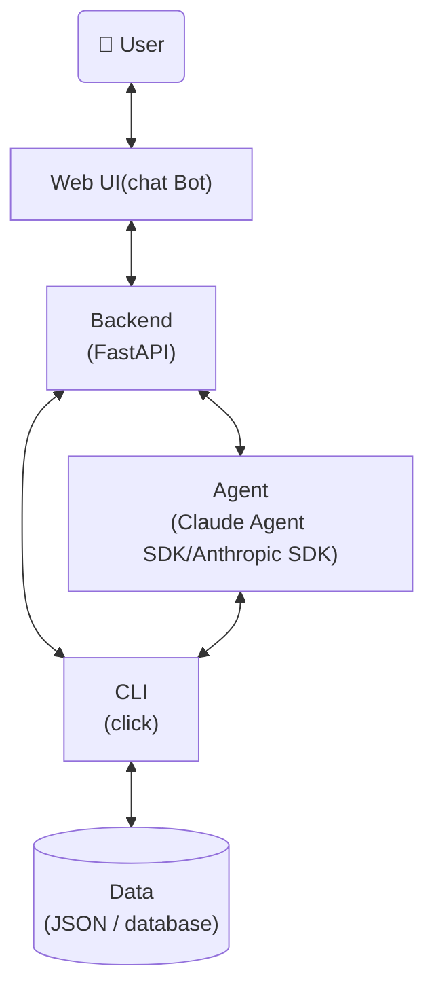

# AI agent design pattern
AI agent设计范式，按照以下章节进行设计与文档输出

## 参考架构


```mermaid
graph TD
    User("👤 User")
    WebUI["Web UI(chat Bot)"]
    Backend["Backend<br/>(FastAPI)"]
    Agent["Agent<br/>(Claude Agent SDK/Anthropic SDK)"]
    CLI["CLI<br/>(click)"]
    Data[("Data<br/>(JSON / database)")]

    User <--> WebUI
    WebUI <--> Backend
    Backend <--> Agent
    Backend <--> CLI
    Agent <--> CLI
    CLI <--> Data
```

## Data layer

### data schema
- `doc/data-schema.md`中定义所有基础数据结构，使用`dataclass`定义，CLI脚本中直接使用
- 结合业务场景，合理定义简洁、清晰的数据结构，避免过度设计
- 合理使用数据类型

### data persistence
- `doc/data-persistence.md`中定义数据持久化策略，包括文件存储、数据库存储等
- 优先json、excel等简单持久化存储，对于较复杂场景，考虑使用数据库存储

## CLI layer

### CLI设计原则
- `--help as doc`: `doc/cli.md`中列出所有cli的`--help`设计，具备详细、清晰的命令行帮助文档，开发人员或agent能够根据`--help`内容明确CLI功能、原理、输入输出、使用方法，agent调用脚本之前，必须先查看`--help`
- data-oriented: CLI以数据为中心，提供`data layer`数据相关的操作，如查询、修改、新增、删除等，command与入参设计保持精简，避免过度设计
- 结构化输入输出：除了常规CLI的arguments/options，提供json格式输入全量入参，输出格式统一使用json，方便代码或agent解析
- 使用`click`框架
- 使用`dataclass`定义data schema

## Web UI设计

### 设计与开发流程
#### 设计先行，所见即所得
- always use skill /frontend-design
- `doc/ui/`目录下，针对每一个网页，创建对应UI预览`html`文件，用于与用户讨论、修改、确认UI设计规格，使用mock数据
- 开发阶段按照`doc/ui/`下的网页设计规格，一比一同步至`frontend/`目录下，并完成相关前后端开发
- 每次修改后使用`playwright`验证前端UI修改是否生效，功能正常

## backend设计
### 设计原则
- 混合模式：CLI提供的命令直接走 API Server，chatbot自然语言调用Agent处理
- 提供 RESTful 风格API
- API Server 薄层封装，仅包含必要业务逻辑

```
Web UI → API Server(FastAPI) ┬→ CLI→ Data
                              └→ Agent（分析/自然语言）→ CLI → Data
```

### API设计
<列出API接口定义以及描述，包括每个API的路径，功能描述，输入、输出>

### API时序图
<使用mermaid语法列出API的调用流程，与内部模块（如agent、cli、data layer）的交互流程>

## agent设计
- use Claude SDK (Anthropic SDK) or Claude Agent SDK
- use skill /claude-api

## scripts
创建基本agent部署运维脚本，要求脚本打印human-friendly output用户阅读
- start.sh
- stop.sh
- restart.sh
- status.sh

## 测试设计

### 测试用例类型
- 单元测试（UT）: 验证子模块或类核心逻辑，mock外部依赖
- 集成测试（IT）: 整体前后端端到端功能验证，使用真实依赖

### 测试用例运行方式
针对单元测试与集成测试，各自提供执行脚本，自动化全量运行，生成测试报告
```
test/run_ut.py
tets/run_it.py
```

## 代码目录结构
```
agent/
cli/
doc/
    ui/ # UI设计demo目录
    cli.md # CLI命令定义
    data-schema.md # 数据结构定义
    data-persistence.md # 数据持久化存储设计
script/
backend/
frontend/
test/
README.md # 项目介绍，使用方法，部署说明
```
