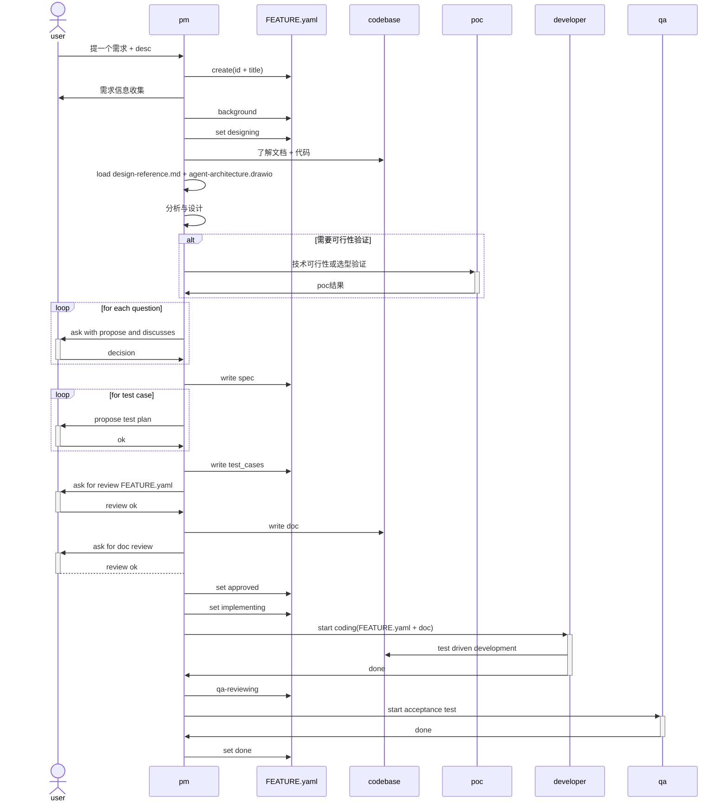

# feature
## schema
- id # feature编号
- title # feature标题，与目录一致
- desc # 需求描述
- agent_type
- background # 需求背景，为什么要做这个需求
    - pain_point # 解决什么痛点
    - benefit # 带来什么收益
- spec # 需求规格
    - module # 模块名
        - functions # 功能、修改点
            1. function_1 
            2. function_2
        - schema # data schema
        - interface # API CLI
- test_cases[]

## state
  draft → designing → approved → implementing → qa-reviewing → done
  任意状态 → cancelled

## workflow
