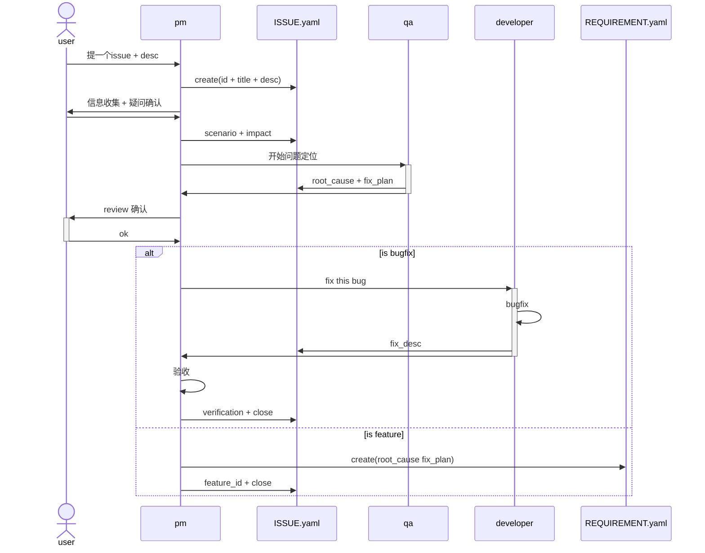

# Issue
## schema
- id # issue编号
- title # issue标题，与目录一致
- desc # 问题描述
- scenario # 场景
- impact # 问题影响
- root_cause # 问题根因
- fix_plan # 修改方案
- result # issue处理结果
    - bugfix
        - fix_desc # 修改内容
        - verification # 验证结果
    - feature_request # 转需求
        - feature_id # 需求编号

## workflow
