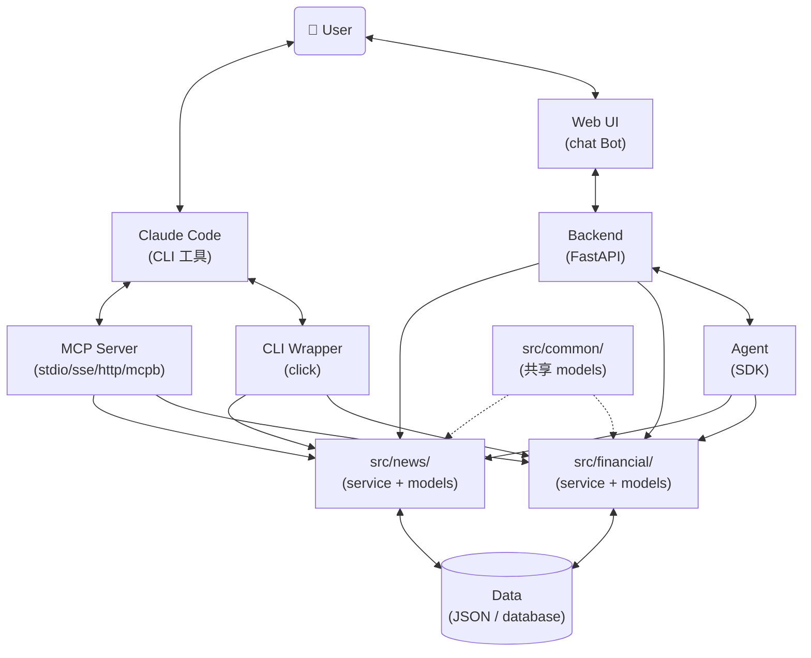

# Design Reference

> PM 设计阶段按需读取的参考手册。包含 doc/ 文件章节契约、字段设计原则、跨文件归属表等规则。
> 进入 `designing` 状态时，PM 应读本文件后再撰写 doc/。

## 目录

- [设计工作原则](#设计工作原则)
- [Agent Type 与形态分流](#agent-type-与形态分流)
  - [四种形态](#四种形态)
  - [mcp-server 子模式（Deploy Mode）](#mcp-server-子模式deploy-mode)
  - [接入层取舍](#接入层取舍)
- [Agent参考架构](#agent参考架构)
- [doc/<module>/ 章节契约](#docmodule-章节契约)
  - [data-schema.md（业务数据结构定义）](#data-schemamd业务数据结构定义)
  - [data-persistence.md（数据存储方案）](#data-persistencemd数据存储方案)
  - [service.md（Service 接口契约 + 流程 + 模块关系）](#servicemd-service-接口契约--流程--模块关系)
  - [cli.md（CLI 契约，仅 cli-only 形态）](#climd-cli-契约仅-cli-only-形态)
- [跨文件内容归属表](#跨文件内容归属表)
- [doc/ 内容规则（最终正式文档，全 doc/ 适用）](#doc-内容规则最终正式文档全-doc-适用)
  - [适用范围](#适用范围)
  - [✅ 允许的内容](#-允许的内容)
  - [❌ 禁止的内容（过程性）](#-禁止的内容过程性)
  - [撰写自检（写完每个 doc 文件后）](#撰写自检写完每个-doc-文件后)
  - [反例（过程性内容混入 doc/，禁止）](#反例过程性内容混入-doc禁止)
- [共享数据提议流程](#共享数据提议流程)
- [设计文档输出规范](#设计文档输出规范)
- [Data Schema](#data-schema)
  - [文件内容](#文件内容)
  - [字段设计原则（核心）](#字段设计原则核心)
  - [字段类型选型原则](#字段类型选型原则)
  - [关键原则](#关键原则)
- [Data Persistence](#data-persistence)
- [CLI Layer](#cli-layer)
  - [CLI 设计原则](#cli-设计原则)
  - [CLI 设计归属（无 DESIGN.md，分三阶段）](#cli-设计归属无-designmd分三阶段)
- [Agent Layer](#agent-layer)
- [Backend Layer](#backend-layer)
- [代码目录结构](#代码目录结构)
  - [基线结构（cli-only）](#基线结构cli-only)
  - [其他形态相对 cli-only 的差异](#其他形态相对-cli-only-的差异)
  - [CLI 调用方式](#cli-调用方式)

## 设计工作原则

- **图表优先**：流程、交互、依赖关系优先用 mermaid 表达（flowchart / sequence / state）。能用图说明的不写文字；文字仅作图的补充说明
- **聚焦核心**：文档核心是四类内容 —— 数据结构定义、CLI 定义、模块边界与依赖、接口交互。其余（背景、概述、理由）保持精简
- **可审计性**：每个设计决策都必须记录选择理由，使设计过程可追溯
- **可讨论性**：设计方案应先与用户讨论确认后再定稿，不擅自做重大架构决定

## Agent Type 与形态分流

接到设计任务时，第一步从 REQUIREMENT.yaml 读取 `Agent Type`，按形态决定产出哪些 artifact。

### 四种形态

| Agent Type | 描述 | 关键 artifact |
|------------|------|---------------|
| `cli-only` | 纯 CLI，给 Claude Code / nanobot 调用 | `src/` + `cli/<module>.py` + `doc/<module>/` |
| `http-api` | HTTP API 服务，无前端 | `src/` + `backend/` + `doc/backend.md` |
| `http-web` | HTTP 服务 + Web UI | `src/` + `backend/` + `doc/backend.md` |
| `mcp-server` | MCP server，给 Claude Code 当工具 | `src/` + `mcp-server/` + `doc/mcp-server.md` |

### mcp-server 子模式（Deploy Mode）

`mcp-server` 形态必须在 REQUIREMENT.yaml 填 `Deploy Mode`：
- `stdio`：Claude Code 启动本地进程，无鉴权，无 script/
- `sse` / `http`：远程服务，需鉴权 + 部署脚本
- `mcpb`：打包分发，需 `.mcpb` 文件结构

### 接入层取舍

- `cli-only`：写 `cli/<module>.py`（click 脚本，调用 `src/<module>/service.py`）
- `http-api` / `http-web`：写 `backend/`（FastAPI），**不写 CLI**
- `mcp-server`：写 `mcp-server/`，**不写 CLI、不写 backend/**

## Agent参考架构



## doc/<module>/ 章节契约

每个 doc/<module>/ 文件按以下章节组织。撰写前对照契约，撰写后自检章节是否合规。

### data-schema.md（业务数据结构定义）

> 仅定义业务实体（dataclass / enum），含字段语义、值约束。**完全不涉存储**。

**应有章节**：
- 文件标题 + 一句话业务说明
- N × `## <EntityName> -- <一句话业务角色>` dataclass 定义

**不应有章节**：SQLite Schema / Field Mapping / 去重 key / 不存储说明 / 变更记录

模板：

```markdown
# <Module> Data Schema

> 该 module 业务数据结构定义。仅定义"是什么"，不涉"怎么存"（存储见 data-persistence.md）。

## <EntityName> -- <一句话业务角色>

@dataclass
class <EntityName>:
    """<业务说明>"""
    field_a: str
        # <字段描述>。示例: <值>
        # 约束: <非显然约束>
```

### data-persistence.md（数据存储方案）

> 聚焦"怎么存"——介质、Schema、读写、生命周期。**引用 data-schema 的 dataclass，不重复定义字段语义**。

**应有章节**：
- `## 存储介质`
- `## Schema`（含 CREATE TABLE / 索引 / 字段映射）
- `## 读写机制`
- `## 数据生命周期`（初始化 / 清理 / 备份）
- `## 配置`（环境变量、路径参数）

**不应有章节**：dataclass 重复定义 / 决策对比 / 实测数据

### service.md（Service 接口契约 + 流程 + 模块关系）

> Service.py 的实现契约。仅描述"是什么/怎么调用/怎么走流程"，**不解释"为什么这么设计"**。

**应有章节**：
- `## Service 接口`（class + 方法签名 + docstring）
- `## 关键流程`（mermaid sequence，按 use case 组织）
- `## 模块关系`（mermaid graph + 依赖说明）

**不应有章节**：方案概览 / 问题背景 / 关键技术决策 / 决策 N / 异常场景（issue 引用）/ 实测数据

### cli.md（CLI 契约，仅 cli-only 形态）

> 设计期产出，作为 developer 实现 `cli.py` 的契约。`--help` 运行时输出应与本文档一致。

**应有章节**：
- 文件标题 + 一句话说明
- N × `## <command>` 章节，每个含：
  - 功能说明（脚本用途、内部实现原理）
  - 输入 schema（arguments / options / `--json-input` 示例）
  - 输出 schema（成功响应 + 失败响应 + 错误码）
  - 使用示例（典型调用）

**不应有章节**：dataclass 定义 / 决策讨论 / 设计过程

## 跨文件内容归属表

每写一段内容前，先对照下表判断归属。命中"应写到 REQUIREMENT.yaml / 删"的，**不要写到 doc/**。

| 内容类别 | 应写到 | 不应写到 |
|---------|--------|---------|
| 业务字段定义（dataclass） | data-schema.md | data-persistence.md |
| 字段语义/约束 | data-schema.md（字段注释） | data-persistence.md |
| 内存对象（不持久化）dataclass | data-schema.md | data-persistence.md |
| CREATE TABLE / DDL | data-persistence.md | data-schema.md |
| 索引定义 | data-persistence.md | data-schema.md |
| Column ↔ 字段映射（仅非一一对应时） | data-persistence.md | data-schema.md |
| 存储介质选型理由 | data-persistence.md（一句话）+ REQUIREMENT.yaml 需求规格 > 技术决策（深度） | service.md |
| 读写机制 | data-persistence.md | data-schema.md |
| 数据生命周期 | data-persistence.md | service.md |
| 配置（环境变量/路径） | data-persistence.md | service.md |
| Service 方法签名 | service.md | - |
| Service 关键流程 | service.md | - |
| 模块依赖关系 | service.md | - |
| CLI 命令清单（产品级） | REQUIREMENT.yaml 关键接口 | cli.md |
| CLI 详细 JSON I/O schema | cli.md（仅 cli-only） | data-schema.md / service.md |
| CLI 错误码定义 | cli.md（仅 cli-only） | data-schema.md |
| CLI 使用示例 | cli.md（仅 cli-only） | data-schema.md |
| 设计决策 | REQUIREMENT.yaml 需求规格 | doc/ |
| 决策对比（方案 A/B/C） | REQUIREMENT.yaml 需求规格 | doc/ |
| 实测数据 / POC 命中率 | REQUIREMENT.yaml 需求规格 | doc/ |
| Issue 引用（QA-XXX） | REQUIREMENT.yaml 需求规格 | doc/ |
| 异常场景（接口契约） | service.md（方法 docstring） | - |
| 异常场景（issue 上下文） | REQUIREMENT.yaml 需求规格 | service.md |
| 变更记录 / "X 已删除" | 删（不应存在任何 doc/） | 任何 |

## doc/ 内容规则（最终正式文档，全 doc/ 适用）

`{Root}/doc/` 下的所有文件是**最终正式文档**，仅承载"是什么"（定义、契约、方案），**不承载"为什么"**（决策、讨论、分析过程）。所有过程性内容只能写在 REQUIREMENT.yaml 需求规格。

### 适用范围

所有 `{Root}/doc/` 下的 .md 文件：
- `doc/<module>/data-schema.md`、`doc/<module>/data-persistence.md`、`doc/<module>/service.md`、`doc/<module>/cli.md`（cli-only）
- `doc/common/data-schema.md`
- `doc/backend.md`、`doc/mcp-server.md`

### ✅ 允许的内容

按文件类型分布（详见上方"doc/<module>/ 章节契约"和"跨文件内容归属表"）：

- `data-schema.md`：dataclass 定义 + 字段注释（字段关系、不变量、合法值集合写在字段注释里）
- `data-persistence.md`：存储方案（介质、Schema、读写机制、生命周期、配置）
- `service.md`：Service 接口 + 关键流程（mermaid sequence）+ 模块关系（mermaid graph）
- `backend.md` / `mcp-server.md`：API/tools 的 input/output schema、调用流程图

### ❌ 禁止的内容（过程性）

详见上方"跨文件内容归属表"。重点：

- "本期 Constraints 明确排除..."、"留给后续 feature"、"YAGNI 排除" → 移到 REQUIREMENT.yaml 需求规格 > 约束/原则
- 与其他 module 的对比说明（除非字段语义必需）
- 决策讨论、issue 引用、实测数据、变更记录等 → 见归属表对应行

### 撰写自检（写完每个 doc 文件后）

扫描文件内容，命中以下任一关键词即删或迁出：

| 启发式关键词 | 处理 |
|-------------|------|
| "OQ-"、"Open Question"、"Q1: ... A:" | 移到 REQUIREMENT.yaml 需求规格 |
| "决策"、"为什么"、"权衡"、"vs"、"相比" | 移到 REQUIREMENT.yaml 需求规格 |
| "本期 Constraints 明确排除"、"YAGNI"、"留给后续"、"待定" | 移到 REQUIREMENT.yaml 需求规格 > 约束/原则 |
| "第一版 / 第二版"、"变更记录"、"架构调整" | 删除（git history 已记录） |
| "用户补充"、"用户决策"、"讨论中确认" | 删除（已落在 REQUIREMENT.yaml 需求规格） |

### 反例（过程性内容混入 doc/，禁止）

```markdown
### <EntityName>

@dataclass
class <EntityName>:
    ...

**设计决策（OQ-X 答案）**：<某设计选择的理由>。
理由：① ... ② ... ③ ...
```

正解（仅留 dataclass + 字段注释，描述清晰 + 关键约束）：

```markdown
### <EntityName> -- <一句话业务角色>

@dataclass
class <EntityName>:
    field_a: str
        # <字段描述>。约束：YYYY-MM-DD
    field_b: int
        # <字段描述>。约束：> 0
    field_c: <EnumName>
        # <字段描述>（值1 / 值2 / 值3）
```

决策"为什么共用 list" → REQUIREMENT.yaml 需求规格。

## 共享数据提议流程

设计中如发现某数据结构（如 `AuditLog`）需要被 ≥2 个 module 使用，按以下流程提议加入 `doc/common/data-schema.md`：

1. 在 REQUIREMENT.yaml 需求规格 新增"提议 common 数据结构"条目：
   - 结构名、dataclass 字段定义
   - 使用方（≥2 module）
   - 理由（为什么不归属单一 module）
2. PM 初步 review：合理性 + 是否真共享
3. 用户在 REQUIREMENT.yaml review 时确认
4. 通过后直接写入 `doc/common/data-schema.md`
5. 各 module 在自己的 `data-schema.md` 中 import 引用，**不重复定义字段**

## 设计文档输出规范

设计完成后，按以下结构输出文档到 `{Root}/doc/` 目录（无 DESIGN.md）：

| 文件 | 内容 | 适用形态 |
|------|------|----------|
| `{Root}/doc/<module>/data-schema.md` | 该 module 业务数据结构定义（dataclass + 字段注释） | 所有形态 |
| `{Root}/doc/<module>/data-persistence.md` | 该 module 数据持久化方案 | 所有形态 |
| `{Root}/doc/<module>/service.md` | Service 方法签名 + 关键流程 mermaid + 跨 module 关系图 | 所有形态 |
| `{Root}/doc/common/data-schema.md` | 跨 module 共享数据结构（User/AuditLog/Pagination 等） | 所有形态（如需） |
| `python3 {Root}/cli/<module>.py --help` | CLI 命令运行时输出（无静态文件；命令清单在 REQUIREMENT.yaml 关键接口定） | cli-only |
| `{Root}/doc/backend.md` | 后端技术选型 + REST API 设计 | http-api / http-web |
| `{Root}/doc/mcp-server.md` | MCP tools 清单 + 部署模式 + 调用流程 | mcp-server |


## Data Schema

设计文档 `{Root}/doc/<module>/data-schema.md`（按 module 拆分，跨 module 共享部分写在 `{Root}/doc/common/data-schema.md`）

### 文件内容

- 结合业务场景、功能，使用合理数据类型，定义简洁、清晰的数据结构
- 每个数据结构使用 `python dataclass` 定义，class 与每个 field 配文字描述

### 字段设计原则（核心）

Agent 设计围绕结构化数据 —— 所有业务、交互、功能都用 `dataclass` 表示和承载。`data-schema.md` 是单一真值。

**每个字段必须有清晰注释**，按"必需 + 按需"原则写：

1. **字段描述（必需）**：字段是什么、做什么、关键语义。不写"用途："标签 —— 描述本身就是用途
   - 复杂或易混淆字段附**示例值**（如 `# 券商名称。示例："国金证券（佣金宝）"`）
   - 字段名已经一目了然时可极简（如 `note: str = ""  # 备注（可选）`）
2. **使用场景（按需）**：仅当字段被多个 CLI/API/UI 场景使用且需要厘清时写。简单字段（仅展示 + 持久化）可省
3. **约束（按需，关键）**：仅写**非显然约束**：
   - ✅ 写："> 0"、"必须 ∈ enum"、"YYYY-MM-DD 格式"、"自动计算 = price * quantity"、"不可变"
   - ❌ 不写："非空字符串"、"必填"、"str 类型" 等显然约束（浪费空间）
   - 不强制每字段都有约束；没特殊约束就不写

**示例 1** — 详细风格（关键业务实体）：

```python
@dataclass
class <EntityName>:
    """<一句话业务角色说明>。<可选：列出主要使用场景>"""
    amount: float
        # <字段描述>。示例：5000.00
        # 约束：> 0；2 位小数
    category: <EnumName>
        # <字段描述>（值1 / 值2 / 值3）
    created_at: date
        # <字段描述>
        # 约束：自动写入当下日期；不可变
    note: str = ""
        # 备注（可选）
```

**示例 2** — 极简风格（简单数据类）：

```python
@dataclass
class <EntityName>:
    """<一句话业务角色说明>。"""
    date: str           # <字段描述>。约束：YYYY-MM-DD
    type: <EnumName>    # <字段描述>（值1 / 值2）
    price: float        # <字段描述>。约束：> 0
    quantity: int       # <字段描述>。约束：> 0，整数
    amount: float       # <字段描述> = price * quantity（service 层自动计算）
    note: str = ""      # 备注（可选）
```

**判断标准（写入字段前自查）**：

| 字段特点 | 处理 |
|---------|------|
| 描述清晰（一句话能说清做什么）+ 非显然约束有标注 | 保留 |
| 描述不清（"将来可能用到"/"看起来应该有"）| 删除（YAGNI） |

**格式一致性（强制）**：同一 data-schema.md 文件内所有 dataclass 必须用同一种注释格式（要么全部三维度行注释，要么全部行尾单行注释）。混用 → 违反规范。

**dos**

- 字段值存在有限集合时，优先使用枚举（Python `enum`）而非字符串常量或整数魔法值
- 数据结构命名清晰、合理，保证一致性
- 文档仅承载数据结构定义，不体现业务使用代码或持久化等其他内容

### 字段类型选型原则

设计每个字段时，按以下原则选类型。**违反任一 = 设计缺陷**，需重新设计。

| 原则 | 反例 | 正解 |
|------|------|------|
| **str 仅用于自由文本**——需被解析/比较/计算/含结构化语义时禁用 | `value: str  # "X 个" / "无限制"` | `value_type: Enum (LIMITED / UNLIMITED)`<br>`value_count: Optional[int]` |
| **数值与单位分离**——单位写进字段名 | `timeout: str  # "30s" / "5m"` | `timeout_seconds: int` |
| **Optional 表"未提供"**——与零值区分（None ≠ 0 ≠ ""） | `count: int = 0  # 无数据时填 0` | `count: Optional[int] = None  # None = 未提供, 0 = 显式零` |
| **成组字段封装 dataclass**——N 字段一起出现一起消失 | `tag_k1: str`<br>`tag_k2: str`<br>`tag_k3: str` | `tags: list[TagItem]`（`TagItem` 含 key + value，可扩展） |

**字段自检**（写完每个字段前对照）：

| 字段类型 / 形态 | 自检 |
|---------------|------|
| `str` | 值是自由文本吗？需解析/比较/计算 → 改类型 |
| 数值字段 | 单位在字段名里吗？ |
| `Optional[X]` | None 语义是"未提供"还是"零值"？后者用默认值 |
| 多个相关字段 | 总是一起出现？若是 → 封装 dataclass |

### 关键原则

- **每个 module 的 `data-schema.md` 作为该 module 数据结构的唯一真值，必须保证跨文档一致性**
- **跨 module 共享数据结构以 `{Root}/doc/common/data-schema.md` 为唯一真值**
- 任何 data-schema 修改需先与用户讨论

## Data Persistence
- 每个 module 在 `{Root}/doc/<module>/data-persistence.md` 中定义该 module 的数据持久化策略（包括文件存储、数据库存储等）
- 持久化方案优先使用 json、yaml 等简单持久化存储，对于较复杂场景，使用数据库方案存储
- `{Root}/doc/<module>/data-persistence.md` 仅定义存储方案，不涉及 CLI 内容

## CLI Layer

### CLI 设计原则
- **`--help as doc`**：CLI 命令文档通过 `python3 {Root}/cli/<module>.py --help` 运行时输出获得（运行期产出），包含：
    - **功能说明**：脚本用途、内部实现原理
    - **输入说明**：参数、选项、结构化输入格式
    - **输出说明**：成功/失败响应结构、错误码定义
    - **使用示例**：典型调用场景
- **设计期契约在 `doc/<module>/cli.md`**：cli-only 形态下设计期写 `cli.md`，含每个命令的 JSON I/O schema、错误码、使用示例，作为 developer 实现 `cli.py` 的契约。developer 实现完成后，`cli.md` 与 `--help` 输出应一致（QA 验收时机械比对）
- data-oriented：CLI 以数据为中心，提供 `data layer` 数据相关的操作，如查询、修改、新增、删除等，command 与入参设计保持精简，避免过度设计
- 结构化输入输出：除了常规 CLI 的 arguments/options，提供 json 格式输入全量入参，输出格式统一使用 json，方便代码或 agent 解析
- 使用 `click` 框架
- 使用 `dataclass` 定义 data schema
- 默认使用 `python3`

### CLI 设计归属（无 DESIGN.md，分三阶段）

cli-only 形态下，CLI 设计分布在三处：

| 阶段 | 文件 | 内容 |
|------|------|------|
| `draft`（PM 与用户讨论） | REQUIREMENT.yaml 关键接口 | 命令清单表 `\| 命令 \| 用途 \| 关键参数 \|`（产品级决策，要做哪些命令） |
| `designing`（设计） | `doc/<module>/cli.md` | 每命令的详细 JSON I/O schema、错误码、使用示例（设计期契约） |
| `implementing`（developer 实现） | `cli/<module>.py` docstring + click decorators → 运行时 `--help` | 实现 `cli.py`，运行 `--help` 输出应与 `cli.md` 一致 |

PM 在 draft 阶段把 CLI 命令清单写到 REQUIREMENT.yaml 关键接口；designing 阶段写 `cli.md` 详细契约；developer 实现 `cli.py` 时按 `cli.md` 写 click decorators + docstring，`--help` 输出应与 `cli.md` 一致。

## Agent Layer

- 使用 Claude SDK (Anthropic SDK) 或 Claude Agent SDK 构建 Agent
- **Agent 职责边界**：Agent 负责理解用户意图、编排任务流程、调用工具（执行实际业务逻辑的工具）
- **Agent 与其他层的交互（按 Agent Type）**：
  - `cli-only`：Agent 通过 CLI wrapper（`cli/<module>.py`）调用 `src/<module>/service.py`
  - `http-api` / `http-web`：Agent（在 Backend 内）直接调用 `src/<module>/service.py`，**不经过 CLI**
  - `mcp-server`：MCP tools 直接调用 `src/<module>/service.py`，**不经过 CLI、不经过 Backend**
- Agent 通过 `src/<module>/service.py` 完成数据操作
- 定义目标 Agent 的 system prompt，可通过 Claude Code 的 append-system-prompt 使用，也可通过 Anthropic SDK 或 Claude Agent SDK 使用，根据实际需求决定
- 实现时可参考 `/claude-api` skill

## Backend Layer

设计文档 `{Root}/doc/backend.md` 内容（仅 `http-api` / `http-web` 形态）：
- backend 技术选型
- REST API 设计，针对每一个 API，列出接口定义，包括接口功能、输入、输出，使用 mermaid 语法列出 API 的调用流程，与内部模块（如 agent、`src/<module>/`、data layer）的交互流程
- **Backend 直接 import `src/<module>/service.py`，不经过 CLI**

## 代码目录结构

### 基线结构（cli-only）

```
{Root}/
  src/
    <module>/
      __init__.py
      service.py            # 业务逻辑
      models.py             # dataclass + enum
    common/                 # 共享数据（按需创建）
      __init__.py
      models.py
  cli/
    <module>.py             # python3 cli/<module>.py --help
  doc/
    <module>/
      data-schema.md
      data-persistence.md
    common/
      data-schema.md        # 按需
  test/
```

### 其他形态相对 cli-only 的差异

| 形态 | 新增 | 移除 |
|------|------|------|
| `http-api` | `backend/`（FastAPI）、`doc/backend.md`、`script/`（start/stop/status.sh）；`agent/` 可选（如需 LLM 编排） | `cli/` |
| `http-web` | 同 `http-api` | `cli/` |
| `mcp-server` | `mcp-server/`（`server.py` + `tools/`）、`doc/mcp-server.md`；`script/`（sse/http/mcpb 需要，stdio 不需要） | `cli/` |

### CLI 调用方式

所有 CLI 调用使用脚本方式：`python3 cli/<module>.py --help`（不使用 `python -m src.<module>.cli`）。

`cli/<module>.py` 内部通过绝对路径 import `src` 业务逻辑：

```python
# cli/<module>.py
import sys, os
sys.path.insert(0, os.path.dirname(os.path.dirname(os.path.abspath(__file__))))
from src.<module>.service import <Module>Service
# ... click 命令定义
```
