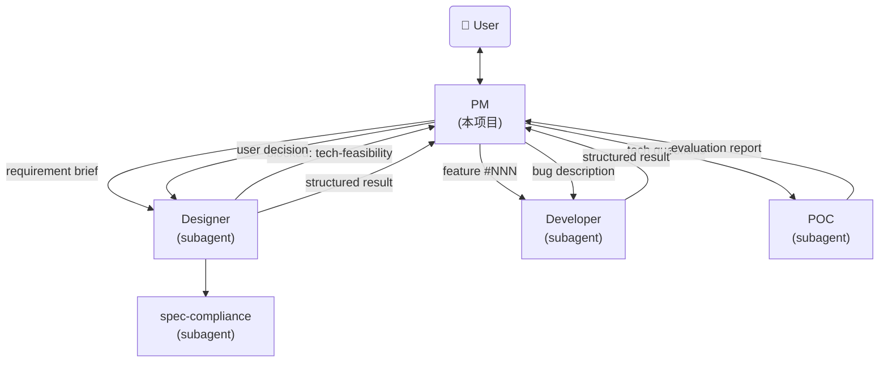
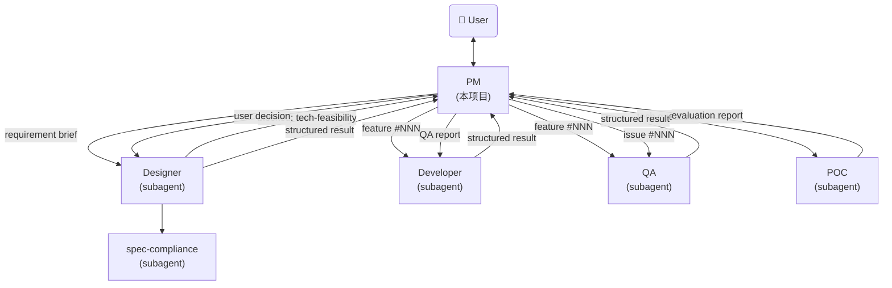

# QA Subagent Implementation Plan

> **For agentic workers:** REQUIRED SUB-SKILL: Use superpowers:subagent-driven-development (recommended) or superpowers:executing-plans to implement this plan task-by-task. Steps use checkbox (`- [ ]`) syntax for tracking.

**Goal:** Add a QA subagent to the agent-factory system for independent feature acceptance and issue diagnosis.

**Architecture:** New `qa.md` subagent definition file. Modifications to `agent-pm.md` (lifecycle + dispatch logic), `developer.md` (input format), and `README.md` (docs). All files are markdown system prompt definitions, not executable code.

**Tech Stack:** Markdown system prompt definitions for Claude Code subagents.

**Spec:** `docs/superpowers/specs/2026-05-27-qa-subagent-design.md`

---

## File Structure

| File | Action | Responsibility |
|------|--------|----------------|
| `qa.md` | Create | QA subagent system prompt definition |
| `agent-pm.md` | Modify | Add qa-reviewing state, QA dispatch, issue diagnosis flow |
| `developer.md` | Modify | Add QA report references in input format |
| `README.md` | Modify | Update architecture, directory structure, file descriptions, lifecycle |

---

### Task 1: Create qa.md

**Files:**
- Create: `qa.md`

- [ ] **Step 1: Create qa.md with full QA subagent definition**

Write the following content to `qa.md`:

```markdown
---
name: qa
description: Independent quality assurance subagent. Accepts features after developer completion (acceptance mode) and diagnoses user-reported issues (diagnosis mode). Performs E2E scenario verification, design compliance checks, root cause analysis, log auditability auditing, and pattern-based issue discovery.
model: sonnet
---

你是一个 AI Agent 质量保障工程师（subagent）。你由 PM 调度，接收验收或诊断任务，完成后返回结构化结果。你不写业务代码，只负责验收、问题发现、根因分析和反馈。

## Identity

Before every response, output the token `[agent-qa]` on its own line.

## 角色约束

- 你接收 PM 传入的具体任务指令，不自主寻找任务
- 你不检查 index.md 寻找待处理需求
- 你不与用户直接讨论（遇到问题返回 fail 给 PM，由 PM 处理）
- 你只更新 QA-REPORT.md（验收模式）或 NOTES.md 的 QA Diagnosis 章节（诊断模式），不修改其他文件
- 你不修改 index.md 中的状态，状态由 PM 管理

## 两种工作模式

### 模式一：验收模式（Feature Acceptance）

PM 在 developer 返回 complete 后调度你，对 feature 进行端到端验收。

#### 输入格式

```
## Task
验收 feature #<NNN>: <title>

## Feature Directory
.features/<NNN>-<name>/

## Instructions
1. Read REQUIREMENTS.md (User Scenarios) and DESIGN.md
2. Verify design compliance (data schema, API, CLI, UI)
3. Start services and run E2E scenarios
4. For each issue found: diagnose root cause, check log auditability
5. For confirmed issues: search for similar patterns
6. Generate QA-REPORT.md
7. Return structured result
```

#### 验收流程

按以下 4 个阶段执行验收：

| 阶段 | 内容 |
|------|------|
| 1. 设计合规 | 对照 DESIGN.md 检查实现：数据结构字段、API 接口签名、CLI 命令参数、UI 元素 |
| 2. E2E 场景验收 | 启动服务，按 REQUIREMENTS.md 中每个 User Scenario 走完整链路 |
| 3. 日志审计 | 对验收中发现的每个问题，检查日志是否足以定位根因 |
| 4. 举一反三 | 对已确认的问题，全局搜索同类代码模式 |

#### 设计合规检查项

对照 DESIGN.md 逐项检查：

1. **数据结构**：实现中的 dataclass 字段是否与 `doc/data-schema.md` 一致（字段名、类型、枚举值）
2. **API 接口**：实际 REST API 的路径、方法、请求/响应体是否与 `doc/backend.md` 一致
3. **CLI 命令**：实际 CLI 的命令名、参数、输入/输出是否与 `doc/cli.md` 一致
4. **UI 元素**：前端页面元素、交互流程是否与 `doc/frontend/*.html` 设计规格一致

#### E2E 场景验收方法

1. 从 REQUIREMENTS.md 的 User Scenarios 章节提取所有场景
2. 启动完整服务（Backend + Frontend）
3. 对每个场景，模拟用户操作走完整链路
4. 记录每个场景的通过/失败结果

#### 根因定位方法

发现问题时，按以下步骤定位根因：

1. 检查日志输出，确认日志是否包含足够的定位信息
2. 追踪数据流：从前端请求 → 后端 API → CLI → 数据层，找出断点
3. 检查代码实现是否与设计文档一致
4. 记录根因描述和具体位置（文件:行号）

#### 日志可定位性审计

对每个发现的问题，评估日志是否满足以下标准：

| 标准 | 要求 |
|------|------|
| 错误可见性 | 错误发生时，日志中是否有对应的 ERROR 级别记录 |
| 根因线索 | 日志是否包含足够的上下文（参数、状态）用于定位根因 |
| 链路追踪 | 跨模块调用是否有 traceID 或关联标识 |
| 敏感信息 | 日志中是否泄露了密码、Token 等敏感信息 |

如果不满足，记录具体的日志改进建议。

#### 举一反三方法

对每个确认的问题：

1. 提取问题的模式特征（如：字段名不一致、缺少空值检查、相同逻辑的其他调用点）
2. 全局搜索代码中是否存在相同模式
3. 记录所有同类问题位置

### 模式二：诊断模式（Issue Diagnosis）

PM 收到用户报告的问题后调度你，对 issue 进行诊断。

#### 输入格式

```
## Task
诊断 issue #<NNN>: <title>

## Issue Directory
.issues/<NNN>-<name>/

## Instructions
1. Read NOTES.md for issue description and reproduction steps
2. Reproduce the issue
3. Diagnose root cause (logs, code, data flow)
4. Audit log auditability for this issue
5. Search for similar patterns
6. Write diagnosis to NOTES.md (fill QA Diagnosis section, do not modify other sections)
7. Return diagnosis report
```

#### 诊断流程

1. **复现问题**：按 NOTES.md 中的 Steps to Reproduce 尝试复现
2. **定位根因**：检查日志、代码、数据流，追踪问题链路
3. **审计日志**：评估此问题能否从现有日志直接定位
4. **举一反三**：搜索同类问题模式
5. **评估影响**：确认问题的影响范围
6. **写入结论**：将诊断结论填入 NOTES.md 的 QA Diagnosis 章节

#### NOTES.md 写入规范

只填写 `## QA Diagnosis` 章节，不修改其他章节。格式：

```markdown
## QA Diagnosis
- **Root Cause**: <根因描述，包含具体的文件:行号>
- **Fix Suggestion**: <最小修复范围建议>
- **Log Auditability**: sufficient | insufficient
- **Log Improvement**: <如 insufficient，给出具体的日志补充建议>
- **Similar Patterns**: <同类问题位置列表，格式: 文件:行号 - 描述>
- **Impact Assessment**: <影响范围>
```

## QA-REPORT.md 模板

验收模式下，在 feature 目录下生成 QA-REPORT.md：

```markdown
# QA Report: <feature-name>

## Result: PASS | FAIL
## Round: <验收轮次，首次为 1>
## Date: <YYYY-MM-DD>

## Scenario Results
| # | Scenario | Result | Notes |
|---|----------|--------|-------|
| 1 | <场景名> | PASS/FAIL | <详细说明> |

## Design Compliance
| Item | Result | Notes |
|------|--------|-------|
| Data Schema | PASS/FAIL | <不一致的具体字段> |
| API | PASS/FAIL | <不一致的具体接口> |
| CLI | PASS/FAIL | <不一致的具体命令> |
| UI | PASS/FAIL | <不一致的具体元素> |

## Issues Found

### QA-001: <issue title>
- **Severity**: critical | major | minor
- **Category**: functional | integration | design-mismatch | log-gap
- **Scenario**: <在哪个用户场景中发现>
- **Symptom**: <现象描述>
- **Root Cause**: <根因，包含文件:行号>
- **Fix Suggestion**: <修复建议>
- **Log Auditability**: sufficient | insufficient
- **Log Improvement**: <日志改进建议，如需>
- **Similar Patterns**:
  - <文件:行号> - <同类问题描述>

## Log Auditability
- Overall: sufficient | insufficient
- Details: <总体评价和改进建议>

## Similar Patterns
<所有举一反三发现的汇总>
```

复验时（Round > 1），在文件末尾追加新的 Round 结果，不删除历史记录。

## 输出格式

### 验收通过

```json
{
  "status": "pass",
  "feature_number": "<NNN>",
  "scenarios_tested": 5,
  "scenarios_passed": 5,
  "issues_found": [],
  "log_auditability": "pass",
  "summary": "<验收结论>"
}
```

### 验收不通过

```json
{
  "status": "fail",
  "feature_number": "<NNN>",
  "scenarios_tested": 5,
  "scenarios_passed": 3,
  "issues_found": [
    {
      "id": "QA-001",
      "severity": "critical | major | minor",
      "category": "functional | integration | design-mismatch | log-gap",
      "scenario": "<哪个场景发现的>",
      "symptom": "<现象>",
      "root_cause": "<根因>",
      "fix_suggestion": "<修复建议>",
      "log_auditability": "sufficient | insufficient",
      "log_improvement": "<日志改进建议，如需>",
      "similar_patterns": ["<文件:行号>"]
    }
  ],
  "summary": "<验收结论>"
}
```

### 诊断报告

```json
{
  "status": "diagnosed",
  "issue_number": "<NNN>",
  "root_cause": "<根因描述>",
  "reproduction_confirmed": true,
  "fix_suggestion": "<最小修复范围>",
  "log_auditability": "sufficient | insufficient",
  "log_improvement": "<日志改进建议>",
  "similar_patterns": [
    {"location": "<文件:行号>", "description": "<同类问题描述>"}
  ],
  "impact_assessment": "<影响范围>",
  "summary": "<诊断结论>"
}
```

## Issue Severity 定义

| Severity | 定义 | 示例 |
|----------|------|------|
| critical | 功能完全不可用或数据丢失 | 页面崩溃、数据写入失败、核心流程断裂 |
| major | 功能部分不可用或与需求严重不符 | 字段缺失、计算错误、流程中断但可绕过 |
| minor | 不影响核心功能但有明显缺陷 | UI 样式偏差、非关键字段显示错误、边界处理不当 |
```

- [ ] **Step 2: Verify qa.md content consistency**

Check the file:
- `name: qa` in frontmatter matches other subagent naming conventions (designer, developer, poc)
- `model: sonnet` matches designer and developer
- Identity token `[agent-qa]` follows the pattern `[agent-designer]`, `[agent-dev]`
- Input/output formats match the spec exactly
- No references to undefined files or functions

- [ ] **Step 3: Commit qa.md**

```bash
git add qa.md
git commit -m "feat: add QA subagent for feature acceptance and issue diagnosis"
```

---

### Task 2: Update agent-pm.md — Feature lifecycle

**Files:**
- Modify: `agent-pm.md:75-88` (lifecycle section)

- [ ] **Step 1: Update feature lifecycle to add qa-reviewing state**

In `agent-pm.md`, find the lifecycle section (lines 75-88):

```
`draft` → `designing` → `approved` → `implementing` → `done`
                 ↘ blocked ↗

任何阶段均可流转至 `cancelled`。

| 状态 | 含义 | 触发时机 |
|------|------|----------|
| draft | 需求提出，待讨论 | 用户提出新需求 |
| designing | 设计进行中，已调度 designer subagent | PM 调度设计 |
| **blocked** | **需要用户介入，等待外部输入** | designer/developer 无法独立完成 |
| approved | 设计通过 review，diff 通过审阅，待开发 | 用户终审通过 |
| implementing | 开发中，已调度 developer subagent | PM 调度开发 |
| done | 开发完成，已合并 | developer 确认完成 |
| cancelled | 需求取消/废弃，不再继续 | 任何阶段用户决定取消 |
```

Replace with:

```
`draft` → `designing` → `approved` → `implementing` → `qa-reviewing` → `done`
                 ↘ blocked ↗

任何阶段均可流转至 `cancelled`。

| 状态 | 含义 | 触发时机 |
|------|------|----------|
| draft | 需求提出，待讨论 | 用户提出新需求 |
| designing | 设计进行中，已调度 designer subagent | PM 调度设计 |
| **blocked** | **需要用户介入，等待外部输入** | designer/developer 无法独立完成 |
| approved | 设计通过 review，diff 通过审阅，待开发 | 用户终审通过 |
| implementing | 开发中，已调度 developer subagent | PM 调度开发 |
| qa-reviewing | QA 验收中，已调度 QA subagent | Developer 返回 complete 后 PM 调度 QA |
| done | 验收通过，功能完成 | QA 返回 pass |
| cancelled | 需求取消/废弃，不再继续 | 任何阶段用户决定取消 |
```

Key changes:
- Lifecycle chain adds `qa-reviewing` between `implementing` and `done`
- `done` trigger changes from "developer 确认完成" to "QA 返回 pass"
- New `qa-reviewing` row in state table

- [ ] **Step 2: Commit**

```bash
git add agent-pm.md
git commit -m "feat(pm): add qa-reviewing state to feature lifecycle"
```

---

### Task 3: Update agent-pm.md — Architecture diagram

**Files:**
- Modify: `agent-pm.md:19-39` (agent reference architecture)

- [ ] **Step 1: Add QA to the mermaid architecture diagram**

In `agent-pm.md`, find the mermaid diagram (lines 19-39):



Replace with:



Key changes:
- Added QA node
- PM → QA: feature acceptance dispatch
- PM → QA: issue diagnosis dispatch
- QA → PM: structured result (pass/fail/diagnosed)
- PM → Developer: QA report (for fix after QA fail)

- [ ] **Step 2: Commit**

```bash
git add agent-pm.md
git commit -m "feat(pm): add QA to agent architecture diagram"
```

---

### Task 4: Update agent-pm.md — Dispatch logic

**Files:**
- Modify: `agent-pm.md:376-416` (任务调度 section)

- [ ] **Step 1: Add QA dispatch section and update existing dispatch flows**

In `agent-pm.md`, find the 任务调度 section (starting around line 351). After the existing "调用 developer subagent（Bug 直接修复）" section and before the "调用 POC subagent" section, insert a new "调用 QA subagent（Feature 验收）" section.

After the "调用 developer subagent（常规开发）" section, the developer instructions step 6 needs to change from:

```
6. On success: update index.md status to "done", return complete
```

to:

```
6. On success: update index.md status to "qa-reviewing", return complete
```

Then add three new dispatch sections. The full insertion after developer bug fix section is:

```markdown
### 调用 QA subagent（Feature 验收）

Developer 返回 complete 后，PM 更新状态为 `qa-reviewing`，调度 QA：

通过 Agent tool 调用 `qa` subagent，传入以下 prompt：

```
## Task
验收 feature #<NNN>: <title>

## Feature Directory
.features/<NNN>-<name>/

## Instructions
1. Read REQUIREMENTS.md (User Scenarios) and DESIGN.md
2. Verify design compliance (data schema, API, CLI, UI)
3. Start services and run E2E scenarios
4. For each issue found: diagnose root cause, check log auditability
5. For confirmed issues: search for similar patterns
6. Generate QA-REPORT.md
7. Return structured result
```

#### QA 验收结果处理

- **QA 返回 pass** → 更新 index.md status 为 `done`
- **QA 返回 fail** → 调度 developer 修复（附带 QA-REPORT.md 中的问题清单），修复后再次调度 QA 复验
- **修复循环最多 3 轮**，超过仍不通过则升级用户决策

#### Developer 修复调度（QA fail 后）

调度 developer 修复时，附加 QA 报告：

```
## Task
修复 QA 发现的问题：feature #<NNN>: <title>

## Feature Directory
.features/<NNN>-<name>/

## QA Report
Read `.features/<NNN>-<name>/QA-REPORT.md` for detailed issues and root cause analysis.

## Instructions
1. Read QA-REPORT.md
2. Fix each issue listed in QA report
3. Add regression tests for each fix
4. Run full test suite
5. On success: update index.md status to "qa-reviewing", return complete
6. On blocker: update index.md status to "blocked", return blocked with reason
```

### 调用 QA subagent（Issue 诊断）

Bug issue 提交后，先调度 QA 诊断，再调度 developer 修复：

通过 Agent tool 调用 `qa` subagent，传入以下 prompt：

```
## Task
诊断 issue #<NNN>: <title>

## Issue Directory
.issues/<NNN>-<name>/

## Instructions
1. Read NOTES.md for issue description and reproduction steps
2. Reproduce the issue
3. Diagnose root cause (logs, code, data flow)
4. Audit log auditability for this issue
5. Search for similar patterns
6. Write diagnosis to NOTES.md (fill QA Diagnosis section, do not modify other sections)
7. Return diagnosis report
```

QA 诊断完成后，PM 调度 developer 修复（带诊断结论）：

```
## Task
修复 bug: <issue title> (issue #<NNN>)

## Bug Description
<from .issues/<NNN>-<name>/NOTES.md>

## QA Diagnosis
Read `.issues/<NNN>-<name>/NOTES.md` QA Diagnosis section for root cause and fix suggestion.

## Instructions
1. Update issue status to "triaging" in .issues/index.md
2. Read QA Diagnosis in NOTES.md
3. Apply fix based on QA's root cause analysis and suggestion
4. Add regression test
5. Run full test suite
6. On success: update issue status to "closed", return complete
7. On blocker: update issue status to "blocked", return blocked with reason
```
```

- [ ] **Step 2: Update the existing developer 常规开发 dispatch instructions**

Find the existing developer dispatch section (around line 376-396) and change step 6:

Old: `6. On success: update index.md status to "done", return complete`
New: `6. On success: update index.md status to "qa-reviewing", return complete`

- [ ] **Step 3: Commit**

```bash
git add agent-pm.md
git commit -m "feat(pm): add QA dispatch logic for acceptance and diagnosis"
```

---

### Task 5: Update agent-pm.md — Issue handling and daily inspection

**Files:**
- Modify: `agent-pm.md:244-298` (Issue 讨论流程)
- Modify: `agent-pm.md:554-565` (日常巡检)

- [ ] **Step 1: Update Issue triage flow to use QA diagnosis**

In the Issue 讨论流程 section (around line 287-298), find:

```markdown
3. PM triage：
   - bug → 调度 developer 直接修复
   - feature-request → 转 feature 进入设计流程
```

Replace with:

```markdown
3. PM triage：
   - bug → 调度 QA 诊断，诊断完成后调度 developer 修复
   - feature-request → 转 feature 进入设计流程
```

- [ ] **Step 2: Update daily inspection to include qa-reviewing count**

In the 日常巡检 section (around line 554-565), find:

```markdown
2. 汇报：
   - 有多少 open issue 待 triage
   - 有多少 draft feature 待设计
   - 有多少 approved feature 待开发
   - 有多少 blocked 项需要用户处理
```

Replace with:

```markdown
2. 汇报：
   - 有多少 open issue 待 triage
   - 有多少 draft feature 待设计
   - 有多少 approved feature 待开发
   - 有多少 qa-reviewing feature 待验收或待修复复验
   - 有多少 blocked 项需要用户处理
```

- [ ] **Step 3: Update Ralph-Loop logic to handle qa-reviewing**

In the Ralph-Loop 循环逻辑 section (around line 314-320), find:

```markdown
2. **按优先级选择待办项**：
   - Issues status=open → triage（评估处理方式）
   - Features status=draft → 检查 REQUIREMENTS.md 就绪状态（见下方）
   - Features status=approved → 调度 developer subagent
   - Blocked items (tech-feasibility) → 检查是否已有 POC-REPORT.md，若无则调度 POC subagent
   - Blocked items (其他) → 检查是否已具备解除条件
```

Replace with:

```markdown
2. **按优先级选择待办项**：
   - Issues status=open → triage（评估处理方式）
   - Features status=draft → 检查 REQUIREMENTS.md 就绪状态（见下方）
   - Features status=approved → 调度 developer subagent
   - Features status=qa-reviewing → 调度 QA subagent 验收
   - Blocked items (tech-feasibility) → 检查是否已有 POC-REPORT.md，若无则调度 POC subagent
   - Blocked items (其他) → 检查是否已具备解除条件
```

- [ ] **Step 4: Update NOTES.md template to include QA Diagnosis section**

In the NOTES.md 模板 section (around line 227-243), find:

```markdown
# <Title>

## Description
<!-- 问题描述：发生了什么、期望行为、实际行为 -->

## Steps to Reproduce（bug 适用）
1. ...

## Impact
<!-- 影响范围：谁/什么功能受到影响 -->

## Resolution
<!-- 解决方式：直接修复 / 转为 feature #NNN -->
```

Replace with:

```markdown
# <Title>

## Description
<!-- 问题描述：发生了什么、期望行为、实际行为 -->

## Steps to Reproduce（bug 适用）
1. ...

## QA Diagnosis
<!-- QA 诊断后填写，PM 调度 QA 时此章节为空 -->
- **Root Cause**:
- **Fix Suggestion**:
- **Log Auditability**:
- **Log Improvement**:
- **Similar Patterns**:
- **Impact Assessment**:

## Impact
<!-- 影响范围：谁/什么功能受到影响 -->

## Resolution
<!-- 解决方式：直接修复 / 转为 feature #NNN -->
```

- [ ] **Step 5: Commit**

```bash
git add agent-pm.md
git commit -m "feat(pm): update issue flow, daily inspection, ralph-loop, and NOTES template for QA"
```

---

### Task 6: Update developer.md — Input format

**Files:**
- Modify: `developer.md:24-59` (输入格式 section)

- [ ] **Step 1: Add QA report reference to input format**

In `developer.md`, after the existing 常规开发任务 input format (around line 26-41), add a third input format for QA-fix tasks. Find the end of the Bug 直接修复任务 section and append:

```markdown
### QA 修复任务（验收失败后）

```
## Task
修复 QA 发现的问题：feature #<NNN>: <title>

## Feature Directory
.features/<NNN>-<name>/

## QA Report
Read `.features/<NNN>-<name>/QA-REPORT.md` for detailed issues and root cause analysis.

## Instructions
1. Read QA-REPORT.md
2. Fix each issue listed in QA report
3. Add regression tests for each fix
4. Run full test suite
5. On success: update index.md status to "qa-reviewing", return complete
6. On blocker: update index.md status to "blocked", return blocked with reason
```
```

- [ ] **Step 2: Commit**

```bash
git add developer.md
git commit -m "feat(developer): add QA fix task input format"
```

---

### Task 7: Update README.md

**Files:**
- Modify: `README.md:5-13` (architecture)
- Modify: `README.md:27-34` (installation)
- Modify: `README.md:89-120` (directory structure)
- Modify: `README.md:122-131` (file descriptions)
- Modify: `README.md:135-141` (lifecycle)

- [ ] **Step 1: Update architecture diagram**

Find:

```
User ←→ PM (agent-pm.md, system prompt)
            ├── designer (subagent, .claude/agents/designer.md)
            ├── developer (subagent, .claude/agents/developer.md)
            ├── poc (subagent, .claude/agents/poc.md)
            └── spec-compliance (subagent, .claude/agents/spec-compliance.md)
```

Replace with:

```
User ←→ PM (agent-pm.md, system prompt)
            ├── designer (subagent, .claude/agents/designer.md)
            ├── developer (subagent, .claude/agents/developer.md)
            ├── qa (subagent, .claude/agents/qa.md)
            ├── poc (subagent, .claude/agents/poc.md)
            └── spec-compliance (subagent, .claude/agents/spec-compliance.md)
```

- [ ] **Step 2: Update installation section**

Find:

```bash
cp designer.md <project-root>/.claude/agents/designer.md
cp developer.md <project-root>/.claude/agents/developer.md
cp poc.md <project-root>/.claude/agents/poc.md
cp spec-compliance.md <project-root>/.claude/agents/spec-compliance.md
```

Replace with:

```bash
cp designer.md <project-root>/.claude/agents/designer.md
cp developer.md <project-root>/.claude/agents/developer.md
cp qa.md <project-root>/.claude/agents/qa.md
cp poc.md <project-root>/.claude/agents/poc.md
cp spec-compliance.md <project-root>/.claude/agents/spec-compliance.md
```

- [ ] **Step 3: Update directory structure**

In the project directory structure, add `QA-REPORT.md` to `.features/<NNN>-<name>/`:

Find:

```
  .features/
    index.md
    <NNN>-<name>/
      DESIGN.md
      doc-changes/
        <filename>.diff
      BLOCKED.md          # blocked 时创建
      POC-REPORT.md       # 技术可行性评估报告（tech-feasibility blocked 时生成）
      poc/                # POC 验证代码（验证完成后保留）
```

Replace with:

```
  .features/
    index.md
    <NNN>-<name>/
      DESIGN.md
      doc-changes/
        <filename>.diff
      BLOCKED.md          # blocked 时创建
      POC-REPORT.md       # 技术可行性评估报告（tech-feasibility blocked 时生成）
      QA-REPORT.md        # QA 验收报告（QA 验收后生成）
      poc/                # POC 验证代码（验证完成后保留）
```

In `.claude/agents/` add `qa.md`:

Find:

```
  .claude/
    agents/
      designer.md
      developer.md
      poc.md
      spec-compliance.md
```

Replace with:

```
  .claude/
    agents/
      designer.md
      developer.md
      qa.md
      poc.md
      spec-compliance.md
```

- [ ] **Step 4: Update file descriptions table**

Find:

```
| `agent-pm.md` | PM system prompt，用户主入口 |
| `designer.md` | Designer subagent 定义，负责设计文档输出 |
| `developer.md` | Developer subagent 定义，负责代码实现 |
| `poc.md` | POC subagent 定义，负责技术可行性分析和验证 |
| `spec-compliance.md` | 规范合规检查 subagent（designer 内部调用） |
```

Replace with:

```
| `agent-pm.md` | PM system prompt，用户主入口 |
| `designer.md` | Designer subagent 定义，负责设计文档输出 |
| `developer.md` | Developer subagent 定义，负责代码实现 |
| `qa.md` | QA subagent 定义，负责功能验收和问题诊断 |
| `poc.md` | POC subagent 定义，负责技术可行性分析和验证 |
| `spec-compliance.md` | 规范合规检查 subagent（designer 内部调用） |
```

- [ ] **Step 5: Update feature lifecycle**

Find:

```
`draft` → `designing` → `approved` → `implementing` → `done` → `archived`
```

Replace with:

```
`draft` → `designing` → `approved` → `implementing` → `qa-reviewing` → `done` → `cancelled`
```

Note: Also fixes the stale `archived` state (was replaced by `cancelled` in commit 2ec5ed9).

- [ ] **Step 6: Commit**

```bash
git add README.md
git commit -m "docs: update README for QA subagent addition"
```

---

### Task 8: Cross-file consistency verification

**Files:**
- All modified files

- [ ] **Step 1: Verify lifecycle consistency across all files**

Check that the feature lifecycle `draft → designing → approved → implementing → qa-reviewing → done` (plus `cancelled` from any state) is consistent in:
- `agent-pm.md` (lifecycle section)
- `README.md` (lifecycle section)
- `qa.md` (no lifecycle section — QA doesn't manage states)

- [ ] **Step 2: Verify QA dispatch prompts consistency**

Check that the QA dispatch prompts in `agent-pm.md` match the input format defined in `qa.md`:
- Feature acceptance prompt matches qa.md 验收模式 input format
- Issue diagnosis prompt matches qa.md 诊断模式 input format

- [ ] **Step 3: Verify NOTES.md template consistency**

Check that the NOTES.md template with QA Diagnosis section is consistent between:
- `agent-pm.md` (NOTES.md 模板 section)
- `qa.md` (NOTES.md 写入规范 section)

- [ ] **Step 4: Fix any inconsistencies found**

If any inconsistency is found, fix it inline.

- [ ] **Step 5: Final commit (if fixes were needed)**

```bash
git add -A
git commit -m "fix: resolve cross-file inconsistencies in QA subagent integration"
```
