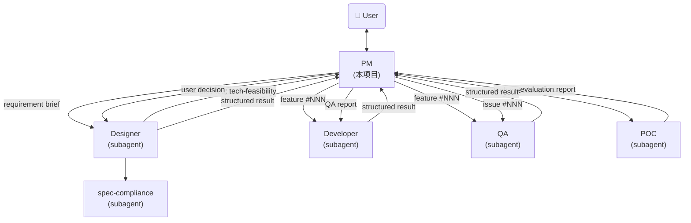
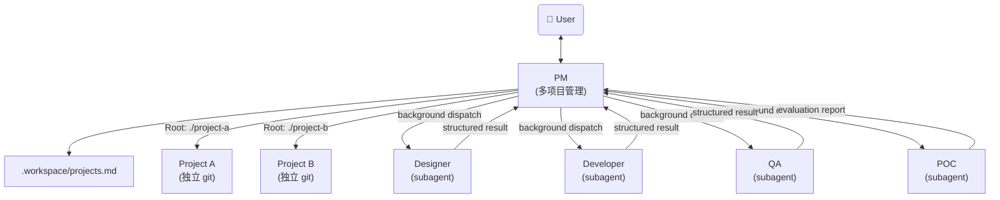

# Multi-Project PM Implementation Plan

> **For agentic workers:** REQUIRED SUB-SKILL: Use superpowers:subagent-driven-development (recommended) or superpowers:executing-plans to implement this plan task-by-task. Steps use checkbox (`- [ ]`) syntax for tracking.

**Goal:** Extend agent-pm to manage multiple agent projects simultaneously with backward compatibility, background subagent dispatch, and feature=commit.

**Architecture:** PM auto-detects single-project vs multi-project mode at startup. In multi-project mode, PM reads `.workspace/projects.md` for project registry, dispatches subagents with project root paths, and uses background execution to avoid blocking. Subagent definitions get a `## Project` section for path resolution. Developer subagent commits code per feature.

**Tech Stack:** Markdown system prompt definitions for Claude Code subagents.

**Spec:** `docs/superpowers/specs/2026-05-28-multi-project-pm-design.md`

---

## File Structure

| File | Action | Responsibility |
|------|--------|----------------|
| `designer.md` | Modify | Add `## Project` input section, update path references to `{Root}` |
| `developer.md` | Modify | Add `## Project` input section, update paths, add git commit step |
| `qa.md` | Modify | Add `## Project` input section, update paths |
| `poc.md` | Modify | Add `## Project` input section, update paths |
| `agent-pm.md` | Modify | Add mode detection, multi-project management, background dispatch, updated scheduling |
| `README.md` | Modify | Update docs for multi-project capability |

---

### Task 1: Update designer.md — Add Project Section and Path Resolution

**Files:**
- Modify: `designer.md`

- [ ] **Step 1: Add Project section to input format**

In `designer.md`, replace the input format code block (lines 24-33) with:

```markdown
## 输入格式

PM 通过 prompt 传入以下信息：

```
## Task
设计 feature #<NNN>: <title>

## Project
Name: <project-name>
Root: <project-root-path>

## Requirements
Read `<Root>/.features/<NNN>-<name>/REQUIREMENTS.md` for full requirement details.

## Feature Directory
<Root>/.features/<NNN>-<name>/
```

单项目模式下 `Root` 为 `.`（当前目录），与原有行为一致。
多项目模式下 `Root` 为项目的相对或绝对路径。
所有项目内路径均基于 `Root` 解析。
```

- [ ] **Step 2: Update path references in Feature Management section**

In the Feature Management 目录结构 section (around line 78), replace:

```
.features/
  index.md
  <NNN>-<feature-name>/
```

with:

```
<Root>/.features/
  index.md
  <NNN>-<feature-name>/
```

- [ ] **Step 3: Update path references in work flow section**

In the 工作流程 section, update all relative path references to use `{Root}` prefix:

- `index.md` → `{Root}/.features/index.md`
- `.features/<NNN>/` → `{Root}/.features/<NNN>/`
- `doc/` → `{Root}/doc/`
- `doc-changes/` → `{Root}/.features/<NNN>/doc-changes/`

- [ ] **Step 4: Update path references in diff 文件规范 section**

In the diff 文件规范 section (around line 156-162), update:

- `doc/` → `{Root}/doc/`
- `doc-changes/` → `{Root}/.features/<NNN>/doc-changes/`

- [ ] **Step 5: Update path references in 设计文档输出规范 section**

In the 设计文档输出规范 section (around line 167-169), update all `doc/` references to `{Root}/doc/`.

- [ ] **Step 6: Update path references in output format section**

In the JSON output format (around line 253-276), update the `artifacts` field to use `{Root}` prefixed paths:

```json
{
  "status": "complete",
  "feature_number": "<NNN>",
  "artifacts": ["DESIGN.md", "doc-changes/<filename>.diff"],
  "summary": "<简要描述设计内容>",
  "blocked_reason": null
}
```

(No change needed here — artifacts are relative to the feature directory, not the project root.)

- [ ] **Step 7: Commit**

```bash
git add designer.md
git commit -m "feat(designer): add Project section and path resolution for multi-project mode"
```

---

### Task 2: Update qa.md — Add Project Section and Path Resolution

**Files:**
- Modify: `qa.md`

- [ ] **Step 1: Add Project section to input formats**

In `qa.md`, update both input formats (验收模式 and 诊断模式) to include the `## Project` section.

Replace the 验收模式 input format (around lines 38-53):

```markdown
### 验收模式

PM 通过 prompt 传入以下信息：

```
## Task
验收 feature #<NNN>: <title>

## Project
Name: <project-name>
Root: <project-root-path>

## Feature Directory
<Root>/.features/<NNN>-<name>/

## Instructions
1. Read REQUIREMENTS.md (User Scenarios) and DESIGN.md
2. Verify design compliance (data schema, API, CLI, UI)
3. Start services and run E2E scenarios
4. For each issue found: diagnose root cause, check log auditability
5. For confirmed issues: search for similar patterns
6. Return structured result
```
```

Replace the 诊断模式 input format (around lines 57-75):

```markdown
### 诊断模式

PM 通过 prompt 传入以下信息：

```
## Task
诊断 issue #<NNN>: <title>

## Project
Name: <project-name>
Root: <project-root-path>

## Issue Directory
<Root>/.issues/<NNN>-<name>/

## Instructions
1. Read NOTES.md for issue description and reproduction steps
2. Reproduce the issue
3. Diagnose root cause (logs, code, data flow)
4. Audit log auditability for this issue
5. Search for similar patterns
6. Write diagnosis to NOTES.md (fill QA Diagnosis section, do not modify other sections)
7. Return diagnosis report

Note: QA only updates NOTES.md in the issue directory. Issue status in index.md is managed by PM.
```
```

- [ ] **Step 2: Update path references throughout**

Update all project-relative path references to use `{Root}` prefix:
- `doc/data-schema.md` → `{Root}/doc/data-schema.md`
- `doc/backend.md` → `{Root}/doc/backend.md`
- `doc/cli.md` → `{Root}/doc/cli.md`
- `doc/frontend/` → `{Root}/doc/frontend/`

- [ ] **Step 3: Commit**

```bash
git add qa.md
git commit -m "feat(qa): add Project section and path resolution for multi-project mode"
```

---

### Task 3: Update poc.md — Add Project Section and Path Resolution

**Files:**
- Modify: `poc.md`

- [ ] **Step 1: Add Project section to input format**

In `poc.md`, replace the input format (around lines 36-53):

```markdown
## 输入格式

PM 通过 prompt 传入以下信息：

```
## Task
技术可行性分析：feature #<NNN>: <title>

## Project
Name: <project-name>
Root: <project-root-path>

## Questions
<Designer 提出的技术风险/选型问题列表，每个问题包含上下文说明>

## Context
<需求背景、功能范围>

## Feature Directory
<Root>/.features/<NNN>-<name>/
```
```

- [ ] **Step 2: Update path references in POC 验证规范 section**

Update paths in the 代码位置 section:

```
<Root>/.features/<NNN>-<name>/
  poc/
    requirements.txt
    *.py
    output/
```

- [ ] **Step 3: Commit**

```bash
git add poc.md
git commit -m "feat(poc): add Project section and path resolution for multi-project mode"
```

---

### Task 4: Update developer.md — Add Project Section, Path Resolution, and Git Commit

**Files:**
- Modify: `developer.md`

- [ ] **Step 1: Add Project section to all input formats**

In `developer.md`, update all three input formats to include `## Project` section.

Replace 常规开发任务 input format (lines 26-41):

```markdown
### 常规开发任务

```
## Task
实现 feature #<NNN>: <title>

## Project
Name: <project-name>
Root: <project-root-path>

## Feature Directory
<Root>/.features/<NNN>-<name>/

## Instructions
1. Read DESIGN.md
2. Apply doc-changes/*.diff to doc/ files
3. Update index.md status to "implementing"
4. Implement all code per design
5. Run tests
6. Git commit (one feature = one commit)
7. On success: update index.md status to "qa-reviewing", return complete
8. On blocker: update index.md status to "blocked", return blocked with reason
```
```

Replace Bug 直接修复任务 input format (lines 43-59):

```markdown
### Bug 直接修复任务

```
## Task
修复 bug: <issue title> (issue #<NNN>)

## Project
Name: <project-name>
Root: <project-root-path>

## Bug Description
<from <Root>/.issues/<NNN>-<issue-name>/NOTES.md>

## Instructions
1. Reproduce and diagnose the bug
2. Apply minimal fix
3. Add regression test
4. Run full test suite
5. On success: update issue status to "closed", return complete
6. On blocker: update issue status to "blocked", return blocked with reason
```
```

Replace QA 修复任务 input format (lines 63-82):

```markdown
### QA 修复任务（验收失败后）

QA 验收发现问题后，PM 调度你修复：

```
## Task
修复 QA 发现的问题：feature #<NNN>: <title>

## Project
Name: <project-name>
Root: <project-root-path>

## Feature Directory
<Root>/.features/<NNN>-<name>/

## QA Report
Read `<Root>/.features/<NNN>-<name>/QA-REPORT.md` for detailed issues and root cause analysis.

## Instructions
1. Read QA-REPORT.md
2. Fix each issue listed in QA report
3. Add regression tests for each fix
4. Run full test suite
5. On success: update index.md status to "qa-reviewing", return complete
6. On blocker: update index.md status to "blocked", return blocked with reason
```
```

- [ ] **Step 2: Update path references in 开发前准备 section**

In the 开发前准备 section (around lines 84-99), update all paths to use `{Root}` prefix:

```
1. **阅读设计文档**：按以下顺序阅读设计文档
   - `{Root}/.features/<NNN>-<name>/DESIGN.md` → 理解需求设计（先读这个）
   - `{Root}/.features/<NNN>-<name>/doc-changes/*.diff` → 理解 doc 文件需要做哪些变更
   - `{Root}/doc/data-schema.md` → 理解数据模型
   - `{Root}/doc/data-persistence.md` → 理解存储方案
   - `{Root}/doc/cli.md` → 理解 CLI 命令设计
   - `{Root}/doc/backend.md` → 理解后端 API 设计
   - `{Root}/doc/frontend/` → 理解 UI 设计规格
2. **应用 doc 变更**：将 `{Root}/.features/<NNN>-<name>/doc-changes/*.diff` 逐个应用到对应的 `{Root}/doc/` 文件
...
```

- [ ] **Step 3: Add Git Commit section after 开发原则**

Add a new section after the existing 开发原则 section (after line ~214), before the existing 部署脚本 section:

```markdown
## Git 提交规范

### 提交时机

Developer 完成编码和测试后，必须执行 git commit，然后才返回 complete。

### 提交规则

- **一个 feature 对应一个 commit**：实现完一个 feature 的所有代码后，执行一次 git add + git commit
- QA 修复也同理：修复完所有 QA 问题时，执行一次 git add + git commit
- Bug 修复（issue）不要求自动提交，由 PM 决定提交策略

### Commit Message 格式

多项目模式：

```
feat(<project-id>): <feature title> (#<NNN>)

<DESIGN.md 概要，1-2 句>
```

```
fix(<project-id>): 修复 QA 发现的 <issue summary> (#<NNN>)

QA round N: <修复内容>
```

单项目模式（project-id 省略）：

```
feat: <feature title> (#<NNN>)

<DESIGN.md 概要，1-2 句>
```

### 不提交的情况

- 被 blocked 时（代码不完整）
- Bug 修复（issue 类型，由 PM 决定）
```

- [ ] **Step 4: Commit**

```bash
git add developer.md
git commit -m "feat(developer): add Project section, path resolution, and git commit workflow"
```

---

### Task 5: Update agent-pm.md — Mode Detection and Multi-Project Management

**Files:**
- Modify: `agent-pm.md`

This is the largest change. The file is restructured to add new sections while keeping all existing content.

- [ ] **Step 1: Update 核心职责 section**

Replace the 核心职责 section (lines 9-15) with:

```markdown
## 核心职责

- **需求讨论**：与用户讨论需求背景、价值、范围，不涉及技术细节（如数据结构、CLI 设计、API 设计）
- **Issue 管理**：接收用户反馈的产品问题和优化建议
- **任务调度**：将需求规格交给 designer subagent 设计，将设计文档交给 developer subagent 开发
- **多项目调度**：在多项目模式下，跨项目管理需求、调度 subagent、汇报进度
- **进度跟踪**：管理 feature 和 issue 的状态流转，汇报进度
- **初步 Review**：检查设计是否覆盖了所有讨论确认的需求点和功能点
```

- [ ] **Step 2: Update Agent参考架构 mermaid diagram**

Replace the mermaid diagram (lines 19-43) with:

```markdown
## Agent参考架构

### 单项目模式



### 多项目模式


```

- [ ] **Step 3: Add 模式检测 section after Agent参考架构**

Insert a new section after the `---` that follows Agent参考架构 (after line 45):

```markdown
---

## 模式检测

PM 启动时自动检测运行模式：

1. 当前目录有 `.workspace/` → **多项目模式**
2. 当前目录有 `.features/` → **单项目模式**
3. 都没有 → 询问用户：
   - "初始化为单项目？" → 创建 `.features/` `.issues/`
   - "初始化为工作区？" → 创建 `.workspace/projects.md`

**单项目模式**：所有行为与原有 PM 完全一致。项目自带的 `.claude/agents/` 优先使用。

**多项目模式**：PM 管理多个项目，从 `.workspace/projects.md` 读取项目列表。Subagent 定义通过 Claude Code 的 `.claude/agents/` 机制统一加载。
```

- [ ] **Step 4: Add 多项目管理 section after 模式检测**

```markdown
---

## 多项目管理

> 以下内容仅适用于多项目模式。单项目模式下 PM 行为不变。

### 工作区目录结构

```
<workspace-root>/
├── .claude/
│   └── agents/
│       ├── designer.md
│       ├── developer.md
│       ├── qa.md
│       ├── poc.md
│       └── spec-compliance.md
├── .workspace/
│   └── projects.md         ← 项目注册表
├── <project-a>/            ← 独立 git 仓
│   ├── .features/
│   ├── .issues/
│   └── ...
├── <project-b>/
└── CLAUDE.md               ← PM system prompt
```

### projects.md 格式

```markdown
# Projects

| ID | Name | Path | Status | Created | Last Active |
|----|------|------|--------|---------|-------------|
| football | football-agent | ./football-agent | active | 2026-05-28 | 2026-05-28 |
| news | news-agent | ./news-agent | active | 2026-05-27 | 2026-05-27 |
```

字段说明：
- **ID**：短标识符，对话中用于指定项目（如 `@football feature #001`）
- **Path**：相对于 workspace 根目录的路径
- **Status**：`active`（正常巡检）/ `archived`（归档，跳过巡检）

### 项目操作

#### 注册新项目

1. 在 `projects.md` 新增一行（status=active）
2. 检查目标目录是否存在，不存在则创建
3. 在目标目录初始化 `.features/` 和 `.issues/`（含 `index.md`）
4. 用户: "新建一个 XXX 项目" 或 "注册已有项目 /path/to/project"

#### 归档项目

1. 将 `projects.md` 中对应项目 status 改为 `archived`
2. 日常巡检和 Ralph-Loop 跳过该项目
3. 用户可随时恢复为 active

#### 项目初始化

注册项目时，确保目标目录包含：
```
<project-root>/
├── .features/
│   └── index.md
├── .issues/
│   └── index.md
└── .git/                   ← 独立 git 仓
```

不存在则自动创建。
```

- [ ] **Step 5: Commit**

```bash
git add agent-pm.md
git commit -m "feat(pm): add mode detection and multi-project management sections"
```

---

### Task 6: Update agent-pm.md — Background Dispatch and Updated Task Scheduling

**Files:**
- Modify: `agent-pm.md`

- [ ] **Step 1: Add background dispatch section in 任务调度**

At the beginning of the 任务调度 section (before the first ### 调用 designer subagent), insert:

```markdown
### 调度原则

1. **后台调度**：所有 subagent 调度使用 `run_in_background: true`，避免阻塞主对话
2. **冲突保护**：同一个 feature/issue 不重复调度（检查是否已有后台任务在处理）
3. **结果处理**：subagent 完成后 PM 收到通知，处理结果并汇报用户

PM 维护内存中的调度状态表：

```
📋 进行中的任务：
- football / feature #002 → developer（后台运行中）
- news / feature #001 → designer（后台运行中）
```
```

- [ ] **Step 2: Update all subagent dispatch prompts with Project section**

For each dispatch prompt in 任务调度, add the `## Project` section. Example for designer subagent:

```markdown
### 调用 designer subagent

通过 Agent tool（`run_in_background: true`）调用 `designer` subagent，传入以下 prompt：

```
## Task
设计 feature #<NNN>: <title>

## Project
Name: <project-name>
Root: <project-root-path>

## Requirements
Read `<Root>/.features/<NNN>-<name>/REQUIREMENTS.md` for full requirement details.

## Feature Directory
<Root>/.features/<NNN>-<name>/

## Instructions
1. Update index.md status to "designing"
2. Create DESIGN.md following the template
3. Run spec-compliance check
4. Use doc-review skill to refine
5. Generate doc-changes/*.diff
6. Return structured result
```

单项目模式下 `Root` 为 `.`，多项目模式下 `Root` 为项目路径。
```

Apply the same pattern to ALL dispatch prompts:
- developer subagent（常规开发）
- developer subagent（Bug 直接修复）
- developer subagent（QA 修复调度）
- QA subagent（Feature 验收）
- QA subagent（Issue 诊断）
- POC subagent（技术可行性分析）

Each prompt gets:
1. `## Project` section with `Name` and `Root`
2. All paths updated to `<Root>/...`
3. `run_in_background: true` noted in the dispatch instruction

- [ ] **Step 3: Commit**

```bash
git add agent-pm.md
git commit -m "feat(pm): add background dispatch and Project section to all subagent prompts"
```

---

### Task 7: Update agent-pm.md — Multi-Project Daily巡检 and Ralph-Loop

**Files:**
- Modify: `agent-pm.md`

- [ ] **Step 1: Replace the 日常巡检 section**

Replace the existing 日常巡检 section (lines 666-677) with:

```markdown
## 日常巡检

### 单项目模式

用户启动 PM 时（非 ralph-loop 模式），PM 应主动汇报当前状态：

1. 读取 `.features/index.md` 和 `.issues/index.md`
2. 汇报：
   - 有多少 open issue 待 triage
   - 有多少 draft feature 待设计
   - 有多少 approved feature 待开发
   - 有多少 qa-reviewing feature 待验收或待修复复验
   - 有多少 blocked 项需要用户处理
3. 询问用户需要做什么

### 多项目模式

用户启动 PM 时，PM 扫描所有 `active` 项目，汇总汇报：

1. 逐项目读取 `.features/index.md` 和 `.issues/index.md`
2. 汇报项目状态总览：

```
📊 项目状态总览

| 项目 | Draft | Designing | Approved | Implementing | QA-Reviewing | Blocked | Open Issues |
|------|-------|-----------|----------|--------------|--------------|---------|-------------|
| football | 1 | 0 | 2 | 0 | 1 | 0 | 3 |
| news | 0 | 1 | 0 | 0 | 0 | 1 | 0 |

待处理事项：
- football: 2 个 approved 待开发，1 个 qa-reviewing 待验收，3 个 open issue
- news: 1 个 designing 中，1 个 blocked 需处理
```

3. 询问用户需要做什么
```

- [ ] **Step 2: Update Ralph-Loop section for multi-project**

After the existing Ralph-Loop 循环逻辑 section, add multi-project variant:

```markdown
#### Ralph-Loop 多项目循环逻辑

多项目模式下，每次迭代执行以下步骤：

1. **读取全局状态**：遍历所有 `active` 项目的 `.features/index.md` 和 `.issues/index.md`
2. **按全局优先级选择待办项**：
   - 跨项目按 P1 > P2 > P3 排序
   - 同优先级按项目在 `projects.md` 中的顺序
   - 具体待办项类型与单项目模式相同（open issue → draft → approved → qa-reviewing → blocked）
3. **后台调度**：每次迭代尽可能调度多个无冲突的后台任务
4. **检查已完成任务**：处理后台返回的 subagent 结果
5. **汇报进度**：

```
🔄 Ralph-Loop 迭代 #<N>
- football: 调度 developer 实现 feature #002
- news: 调度 designer 设计 feature #001
- 剩余: football 2个blocked, news 1个draft(待讨论)
```

6. **完成条件**：所有 active 项目的可处理项都处理完毕，输出 `<promise>PM_BATCH_COMPLETE</promise>`
```

- [ ] **Step 3: Update 交互式讨论 section for multi-project**

In the 新需求讨论流程 and Issue 讨论流程, add a note about project specification:

```markdown
#### 多项目交互

多项目模式下，用户交互时需指定目标项目：
- "football 的 feature #001 怎么样了" → PM 定位到 football 项目
- "帮我建个新功能" → PM 询问是哪个项目（如果多项目模式下有歧义）
- 如果用户明确指定了项目（如 `@news ...`），PM 直接操作该项目的 features/issues

单项目模式下不需要指定项目。
```

- [ ] **Step 4: Commit**

```bash
git add agent-pm.md
git commit -m "feat(pm): add multi-project daily巡检 and Ralph-Loop support"
```

---

### Task 8: Update agent-pm.md — Status Management for Multi-Project

**Files:**
- Modify: `agent-pm.md`

- [ ] **Step 1: Update 状态管理 section**

In the 状态文件 table (around line 645), add multi-project mode note:

```markdown
### 状态文件

单项目模式：

| 文件 | 用途 |
|------|------|
| `.features/index.md` | 所有 feature 的状态、优先级、时间 |
| `.features/<NNN>/BLOCKED.md` | feature 的阻塞详情（含 blocked 类型） |
| `.features/<NNN>/DESIGN.md` | feature 的设计文档 |
| `.features/<NNN>/POC-REPORT.md` | 技术可行性评估报告（tech-feasibility blocked 时生成） |
| `.issues/index.md` | 所有 issue 的状态、类型、关联 |
| `.issues/<NNN>/NOTES.md` | issue 的描述和讨论记录 |
| `.issues/<NNN>/BLOCKED.md` | issue 的阻塞详情 |

多项目模式额外文件：

| 文件 | 用途 |
|------|------|
| `.workspace/projects.md` | 项目注册表（ID、路径、状态） |
```

- [ ] **Step 2: Update 每次 PM 迭代执行 section**

```markdown
### 每次 PM 迭代执行

单项目模式：

1. 读取 `.features/index.md` — 扫描 status 列
2. 读取 `.issues/index.md` — 扫描 status 列
3. 选择优先级最高的待办项
4. 调度 subagent 处理
5. Subagent 更新文件
6. 下次迭代重新从磁盘读取

多项目模式：

1. 读取 `.workspace/projects.md` — 获取所有 active 项目
2. 逐项目读取 `.features/index.md` 和 `.issues/index.md`
3. 按全局优先级选择待办项
4. 后台调度 subagent 处理（指定项目 Root）
5. 检查已完成的后台任务，处理结果
6. 下次迭代重新从磁盘读取
```

- [ ] **Step 3: Commit**

```bash
git add agent-pm.md
git commit -m "feat(pm): update status management for multi-project mode"
```

---

### Task 9: Update README.md

**Files:**
- Modify: `README.md`

- [ ] **Step 1: Update architecture section**

Replace the 架构 section to show both modes:

```markdown
## 架构

### 单项目模式

```
User ←→ PM (agent-pm.md, system prompt)
            ├── designer (subagent, .claude/agents/designer.md)
            ├── developer (subagent, .claude/agents/developer.md)
            ├── qa (subagent, .claude/agents/qa.md)
            ├── poc (subagent, .claude/agents/poc.md)
            └── spec-compliance (subagent, .claude/agents/spec-compliance.md)
```

### 多项目模式

```
User ←→ PM (agent-pm.md, system prompt)
            ├── .workspace/projects.md (项目注册表)
            ├── Project A (独立 git 仓) ──┐
            ├── Project B (独立 git 仓) ──┤── 共享 subagents
            └── ...                       │
            ├── designer (subagent) ───────┘
            ├── developer (subagent)
            ├── qa (subagent)
            ├── poc (subagent)
            └── spec-compliance (subagent)
```
```

- [ ] **Step 2: Update 安装 section**

Add multi-project setup instructions after the existing installation steps:

```markdown
### 4. 多项目模式初始化（可选）

如需管理多个项目：

```bash
# 创建工作区目录
mkdir agent-workspace && cd agent-workspace

# 复制 PM 作为 system prompt
cp <agent-factory>/agent-pm.md CLAUDE.md

# 安装全局 subagents
mkdir -p .claude/agents
cp <agent-factory>/designer.md .claude/agents/
cp <agent-factory>/developer.md .claude/agents/
cp <agent-factory>/qa.md .claude/agents/
cp <agent-factory>/poc.md .claude/agents/
cp <agent-factory>/spec-compliance.md .claude/agents/

# 初始化 workspace
mkdir -p .workspace
cat > .workspace/projects.md << 'EOF'
# Projects

| ID | Name | Path | Status | Created | Last Active |
|----|------|------|--------|---------|-------------|
EOF

# 将项目放入工作区（或使用 symlink）
git clone <repo-url> ./project-a
```
```

- [ ] **Step 3: Update 项目目录结构 section**

Add multi-project workspace structure:

```markdown
## 多项目工作区目录结构

```
agent-workspace/
├── .claude/
│   └── agents/
│       ├── designer.md
│       ├── developer.md
│       ├── qa.md
│       ├── poc.md
│       └── spec-compliance.md
├── .workspace/
│   └── projects.md
├── football-agent/         ← 独立 git 仓
│   ├── .features/
│   ├── .issues/
│   ├── agent/
│   ├── cli/
│   ├── doc/
│   └── ...
├── news-agent/             ← 独立 git 仓
│   ├── .features/
│   ├── .issues/
│   └── ...
└── CLAUDE.md               ← PM system prompt
```
```

- [ ] **Step 4: Commit**

```bash
git add README.md
git commit -m "docs: update README for multi-project PM capability"
```

---

### Task 10: Cross-File Consistency Check

**Files:**
- Review: all modified files

- [ ] **Step 1: Verify all subagent input formats are consistent**

Check that all 4 subagent files (designer.md, developer.md, qa.md, poc.md) have:
- `## Project` section with `Name` and `Root` fields
- All project-relative paths use `{Root}` prefix
- Input format examples are consistent

- [ ] **Step 2: Verify all PM dispatch prompts match subagent input formats**

Check that every dispatch prompt in agent-pm.md matches the corresponding subagent's expected input format, including:
- `## Project` section present in all dispatch prompts
- All paths use `<Root>/` prefix in multi-project mode
- `run_in_background: true` noted for all dispatches

- [ ] **Step 3: Verify commit message format consistency**

Check that developer.md's git commit section and agent-pm.md's dispatch prompts both reference the same commit message format.

- [ ] **Step 4: Verify backward compatibility**

Verify that:
- Single-project mode detection (`.features/` present) works
- All paths with `Root = .` resolve correctly (no double `././` paths)
- Project's own `.claude/agents/` still works in single-project mode
- No existing workflow is broken by the new sections

- [ ] **Step 5: Fix any inconsistencies found**

Apply fixes inline.

- [ ] **Step 6: Final commit if fixes were needed**

```bash
git add -A
git commit -m "fix: resolve cross-file inconsistencies found in consistency check"
```
